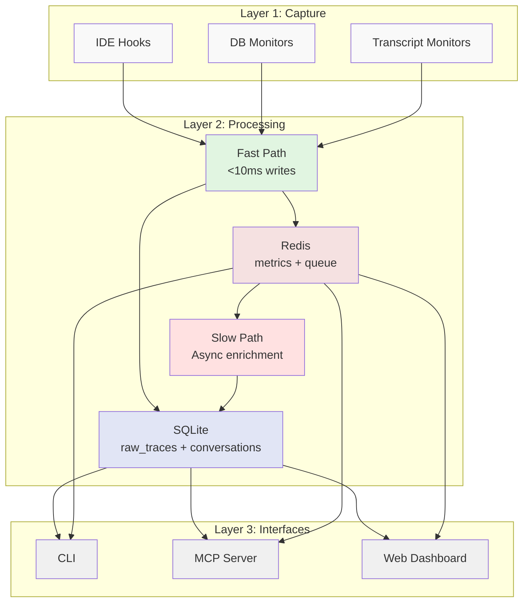
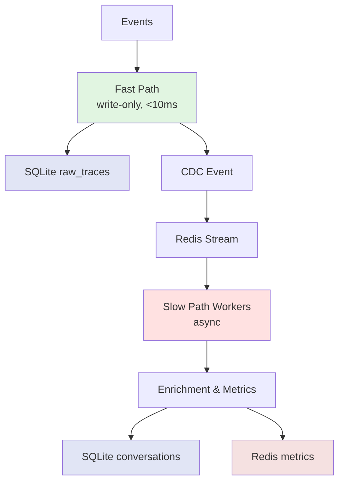
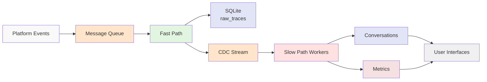

<!--
Copyright © 2025 Sierra Labs LLC
SPDX-License-Identifier: AGPL-3.0-only
License-Filename: LICENSE
-->

# AGENTS.md - Blueplane Telemetry Core Development Guide

This file provides guidance to Claude Code (claude.ai/code) and other AI assistants when working with code in this repository.

## Work Tracking

**IMPORTANT**: Use the `bd` command (beads issue tracker) for tracking all new work instead of markdown todo lists. Create issues for features, bugs, and tasks using:

```bash
bd create "Task description" -p <priority>
bd list                    # View open issues
bd ready                    # Show work-ready issues
bd complete <issue-id>      # Mark as done
```

See the beads documentation for full command reference. All development work should be tracked as beads issues.

### Initializing Beads in a New Worktree

When checking out a new git worktree, the `.beads/beads.db` file (SQLite cache) won't exist because it's gitignored. The source of truth is `.beads/issues.jsonl` (git-tracked).

**Agent initialization workflow:**

1. **Check if beads is available**: Verify `.beads/` directory exists
2. **If `beads.db` is missing but `issues.jsonl` exists**: Run `bd sync --import-only` to import issues from JSONL into the local database cache
3. **Then proceed with normal session start**: Run `bd ready --json` to check available work

**Example initialization:**

```bash
# After checking out new worktree
if [ -d .beads ] && [ -f .beads/issues.jsonl ] && [ ! -f .beads/beads.db ]; then
    bd sync --import-only
fi
bd ready --json
```

**Note**: Beads will auto-import from JSONL on first command if the database is missing, but explicitly running `bd sync --import-only` ensures the database is initialized before checking for work.

## Project Overview

**Blueplane Telemetry Core** is a privacy-first, local-only telemetry and analytics system for AI-assisted coding platforms (Claude Code, Cursor, etc.). All data stays on the developer's machine with zero cloud transmission.

**IMPORTANT**: See architecture documentation in [docs/architecture/](docs/architecture/) for detailed design specifications and implementation patterns.

## Architecture Overview

### Three-Layer Design



1. **Capture Layer** (Layer 1)

   - Lightweight telemetry capture from IDEs
   - IDE hooks, database monitors, transcript monitors
   - Output: Events to file-based message queue
   - Performance: <1ms overhead per event
   - Platform sources:
     - **Claude**: `~/.claude/projects/<project-hash>/<session-hash>.jsonl`
     - **Cursor (User)**: `~/Library/Application Support/Cursor/User/globalStorage/state.vscdb`
     - **Cursor (Workspace)**: `~/Library/Application Support/Cursor/User/workspaceStorage/{uuid}/state.vscdb`
   - See: [layer1_capture.md](docs/architecture/layer1_capture.md)

2. **Processing Layer** (Layer 2)

   - High-performance async event processing
   - Fast path: Zero-read writes, batched inserts
   - Slow path: Async enrichment and metric derivation
   - Databases: SQLite (raw traces + conversations), Redis (metrics + queue)
   - See: [layer2_async_pipeline.md](docs/architecture/layer2_async_pipeline.md)

3. **Interface Layer** (Layer 3)
   - Multiple access methods: CLI, MCP Server, Web Dashboard
   - Only accesses processed data (never raw traces)
   - Performance: <100ms P95 for queries
   - See: [layer3_cli_interface.md](docs/architecture/layer3_cli_interface.md)

### Fast Path / Slow Path Pattern

The core innovation for handling high-volume telemetry:



- **Fast Path**: Immediate writes with zlib compression, zero reads
- **Slow Path**: Async processing with backpressure control
- **Benefits**: Zero-latency ingestion, graceful degradation, eventual consistency

Core implementation:

- Fast path: `src/processing/ingestion/fast_path.py`
- Slow path: `src/processing/workers/slow_path_worker.py`
- CDC stream: `src/processing/change_data_capture.py`

### Data Flow Architecture



### Key Data Types

Core telemetry models (`src/models/`):

- `Event`: Base telemetry event (platform, session_id, timestamp, payload)
- `ConversationTrace`: Reconstructed conversation with turns
- `Metric`: Time-series metric (tokens, latency, errors)
- `SessionContext`: Platform-specific session metadata

Database schemas (`src/processing/database/schemas.py`):

- `raw_traces`: Compressed event storage (Layer 2 only)
- `conversations`: Processed conversation data (Layer 2 & 3)
- `metrics`: Aggregated time-series data

### Database Architecture

**SQLite** (`~/.blueplane/telemetry.db`):

- WAL mode for concurrent reads during writes
- zlib compression (7-10x) for raw events
- Table isolation: raw_traces (Layer 2), conversations (Layer 2 & 3)
- Single file deployment

**Redis** (localhost:6379):

- Streams for message queue with consumer groups
- PEL (Pending Entries List) for automatic retry
- Time-series for metrics with automatic aggregation
- CDC coordination between workers

See: [layer2_db_architecture.md](docs/architecture/layer2_db_architecture.md)

### Platform-Specific Capture Sources

**Claude Code (macOS)**:

- **Session transcripts**: `~/.claude/projects/<project-hash>/<session-hash>.jsonl`
- **Format**: JSONL with conversation turns and tool calls
- **Monitor**: File watcher on JSONL append operations
- **Hooks** (Two implementations available):
  - **HTTP-based hooks** (RECOMMENDED): Zero-dependency hooks using Python stdlib only
    - Install: `python scripts/install_claude_hooks_http.py`
    - Uninstall: `python scripts/uninstall_claude_hooks_http.py`
    - Architecture: Hook (env vars) → HTTP POST → Server (config.yaml) → Redis → Database
    - Configuration: `BLUEPLANE_SERVER_URL` env var (default: http://127.0.0.1:8787)
    - Files: `src/capture/claude_code/hooks_http/` and `src/capture/claude_code/hook_base_http.py`
  - **Redis-based hooks** (DEPRECATED): Direct Redis write with dependencies
    - Install: `python scripts/install_claude_hooks.py` (deprecated)
    - Uninstall: `python scripts/uninstall_claude_hooks.py`
    - Requires: redis, pyyaml, and other Python packages
    - Files: `src/capture/claude_code/hooks/` and `src/capture/claude_code/hook_base.py`
- See: [CURSOR_RAW_TRACES_CAPTURE.md](docs/CURSOR_RAW_TRACES_CAPTURE.md) for parsing details

**Cursor (macOS)**:

- **User-level database**: `~/Library/Application Support/Cursor/User/globalStorage/state.vscdb`

  - Table: `cursorDiskKV` (key-value store)
  - Keys: `composerData:{composerId}` (composer metadata)
  - Keys: `bubbleId:{composerId}:{bubbleId}` (conversation bubbles/messages)
  - Keys: `checkpointId:*`, `codeBlockDiff:*`, `messageRequestContext:*` (auxiliary data)
  - Contains ~20,000+ entries including all conversation content

- **Workspace-level databases**: `~/Library/Application Support/Cursor/User/workspaceStorage/{uuid}/state.vscdb`

  - Table: `ItemTable` (workspace-specific data)
  - Keys: `aiService.generations`, `aiService.prompts`, `composer.composerData`
  - Keys: `workbench.backgroundComposer.workspacePersistentData`, `workbench.agentMode.exitInfo`
  - Contains workspace-specific AI interaction data

- **Architecture**: Two-level storage separating user-global data from workspace-specific data
- **Monitor**: File watching with debouncing, SQLite WAL monitoring, incremental sync
- **Key Insight**: Conversation bubbles are stored separately from composer metadata
- See: [CURSOR_RAW_TRACES_CAPTURE.md](docs/CURSOR_RAW_TRACES_CAPTURE.md) for complete capture specification

**Additional Platforms**:

- VS Code: Similar to Cursor but at `~/Library/Application Support/Code/`
- JetBrains IDEs: Plugin-based capture via custom telemetry API
- Sublime Text: Log file monitoring at `~/Library/Application Support/Sublime Text/`

## Common Development Commands

```bash
# Setup development environment
python -m venv venv
source venv/bin/activate  # or venv\Scripts\activate on Windows
pip install -e ".[dev]"

# Run tests
pytest tests/
pytest tests/ -v --cov=src --cov-report=term-missing

# Hook management (Claude Code)
python scripts/install_claude_hooks_http.py      # Install HTTP hooks (RECOMMENDED - zero dependencies)
python scripts/uninstall_claude_hooks_http.py    # Uninstall HTTP hooks
python scripts/install_claude_hooks.py           # Install Redis hooks (deprecated)
python scripts/uninstall_claude_hooks.py         # Uninstall Redis hooks

# Server management (Layer 2) - RECOMMENDED
python scripts/server_ctl.py start --daemon  # Start in background
python scripts/server_ctl.py stop            # Graceful shutdown
python scripts/server_ctl.py restart --daemon # Restart in background
python scripts/server_ctl.py status --verbose # Detailed status

# Alternative: Direct server start (use server_ctl.py instead)
python -m src.processing.server  # Foreground only, no PID management

# CLI commands (Layer 3)
blueplane status
blueplane metrics --period 1h
blueplane conversations --limit 10

# Database management
blueplane db stats
blueplane db compact
blueplane db export --format parquet

# Development helpers
python scripts/generate_test_events.py --count 1000
python scripts/benchmark_ingestion.py
```

## Testing Philosophy

- **Unit tests**: Next to implementation (`test_*.py`)
- **Integration tests**: Real SQLite + Redis instances
- **Performance tests**: Benchmark scripts in `scripts/`
- **Load tests**: Simulate high-volume event streams
- **Privacy tests**: Verify no code content leakage

Test structure:

```
tests/
├── unit/          # Isolated component tests
├── integration/   # Multi-component tests
├── performance/   # Benchmark tests
└── fixtures/      # Test data and helpers
```

## Important Notes

- **Privacy First**: Never log or store actual code content
- **Local Only**: All data stays on developer's machine
- **Performance Critical**: Fast path must be <10ms P95
- **Eventual Consistency**: Metrics can lag by seconds
- **Error Resilience**: Failed events go to DLQ, never block
- **Zero Config**: Works out of the box with defaults, optional `~/.blueplane/config.yaml` for customization

### Performance Requirements

**Fast Path** (Critical):

- <10ms P95 for 100-event batch
- Zero database reads
- Batched writes with 100ms timeout
- Compression before SQLite write

**Slow Path** (Important):

- <5s P95 for metric updates
- Backpressure monitoring
- Worker health metrics

**Layer 3** (User-facing):

- <100ms P95 for CLI queries
- Proper pagination
- Beautiful Rich terminal output

## Key Files

### Documentation

- **CLAUDE.md** - Project instructions and philosophy
- **README.md** - User-facing documentation
- **docs/ARCHITECTURE.md** - System overview
- **docs/architecture/** - Detailed design specs

### Core Implementation (to be developed)

- **src/capture/** - Layer 1 capture agents
- **src/processing/** - Layer 2 processing pipeline
- **src/interfaces/** - Layer 3 user interfaces
- **src/models/** - Data models and schemas

### Configuration

Blueplane Telemetry Core uses a unified YAML configuration system:

- **config/config.yaml** - Default configuration (bundled with installation)
- **~/.blueplane/config.yaml** - User overrides (highest precedence)
- **config/config.schema.yaml** - Complete schema documentation
- **src/capture/shared/config.py** - Python configuration loader (`Config` class)
- **src/capture/shared/config_models.py** - Typed configuration models (dataclasses)
- **src/capture/cursor/extension/src/config.ts** - TypeScript configuration loader (extension)

#### Configuration Loading

The `Config` class searches for configuration in this order:

1. `~/.blueplane/config.yaml` (user overrides)
2. `config/config.yaml` (relative to source code, for development)
3. Package installation location (for installed packages)
4. `/etc/blueplane/config.yaml` (system-wide)

The config loader automatically:

- Expands `~` in paths to home directory
- Merges user config with defaults
- Provides dot-notation access: `config.get("redis.connection.host")`
- Returns typed objects for common sections: `config.redis`, `config.get_stream_config()`

#### Configuration Structure

The unified config includes these sections:

- **paths**: All file and directory paths (database, IDE locations, workspace storage)
- **redis**: Connection settings, connection pool, socket keepalive
- **streams**: Redis stream configurations (message_queue, dlq, cdc)
- **timeouts**: Database, Redis, session, and extension timeouts
- **monitoring**: Poll intervals, thresholds, health checks for all monitors
- **batching**: Batch sizes and timeouts for event processing
- **logging**: Log levels and feature-specific logging flags
- **features**: Feature flags (e.g., `duckdb_sink.enabled`)

#### Using Configuration in Code

```python
from src.capture.shared.config import Config

# Load config (searches multiple locations automatically)
config = Config()

# Access Redis settings
redis_config = config.redis
host = redis_config.host
port = redis_config.port

# Get stream configuration
stream_config = config.get_stream_config("message_queue")
max_length = stream_config.max_length

# Get monitoring config for specific section
cursor_db_config = config.get_monitoring_config("cursor_database")
poll_interval = cursor_db_config.get("poll_interval", 30.0)

# Get arbitrary config value with dot notation
telemetry_db_path = config.get_path("paths.database.telemetry_db")
redis_host = config.get("redis.connection.host", "localhost")
```

#### TypeScript Extension Configuration

The Cursor extension (`src/capture/cursor/extension/src/config.ts`) loads the same `config.yaml` file and provides typed access:

```typescript
import { ExtensionConfig, loadExtensionConfig } from "./config";

const config = loadExtensionConfig();
const redisHost = config.redis.connection.host;
const pollInterval = config.monitoring.cursor_database.poll_interval;
```

#### Adding New Configuration Options

1. Add the option to `config/config.yaml` with a default value
2. Document it in `config/config.schema.yaml` with type, default, and description
3. Add typed accessor in `src/capture/shared/config.py` if needed (or use `config.get()`)
4. Update `src/capture/shared/config_models.py` if adding new sections
5. Update TypeScript types in `src/capture/cursor/extension/src/config.ts` if needed by extension

## When Adding Features

### Adding a New Capture Source

1. Create capture module in `src/capture/platforms/`
2. Implement `BaseCaptureAgent` interface
3. Add platform-specific event parsing
4. Register in `src/capture/registry.py`
5. Add tests in `tests/unit/capture/`
6. Update [layer1_capture.md](docs/architecture/layer1_capture.md)

### Adding a New Metric

1. Define metric in `src/models/metrics.py`
2. Add derivation logic in `src/processing/metrics/`
3. Update slow path worker in `src/processing/workers/`
4. Add CLI display in `src/interfaces/cli/commands/metrics.py`
5. Add tests for derivation logic
6. Update [layer2_metrics_derivation.md](docs/architecture/layer2_metrics_derivation.md)

### Adding Storage Features

1. Define schema changes in `src/processing/database/migrations/`
2. Update models in `src/models/`
3. Implement in appropriate layer (capture/processing/interface)
4. Add migration script if needed
5. Test with production-like data volumes
6. Update [layer2_db_architecture.md](docs/architecture/layer2_db_architecture.md)

### Adding Interface Features

1. Choose appropriate interface (CLI/MCP/Web)
2. Only access conversations table and Redis metrics (never raw_traces)
3. Implement pagination for large result sets
4. Use Rich for beautiful terminal output
5. Add user-friendly error messages
6. Update relevant Layer 3 documentation

## Development Workflow

1. **Start with docs**: Read architecture specs before implementing
2. **Privacy check**: Ensure no code content exposure
3. **Performance profile**: Benchmark critical paths
4. **Error handling**: Use DLQ for failed events
5. **Test coverage**: Aim for 80%+ on core paths
6. **Documentation**: Update specs when design changes

## Debugging Tips

```bash
# Check message queue status
redis-cli XINFO STREAM telemetry:events

# View pending messages
redis-cli XPENDING telemetry:events workers

# Monitor worker health
redis-cli GET telemetry:worker:health

# Inspect SQLite database
sqlite3 ~/.blueplane/telemetry.db ".tables"
sqlite3 ~/.blueplane/telemetry.db "SELECT COUNT(*) FROM raw_traces;"

# View compressed event
python scripts/inspect_raw_trace.py --event-id <id>

# Check CDC stream
redis-cli XLEN telemetry:cdc

# Monitor metrics
redis-cli TS.RANGE telemetry:metrics:tokens_per_minute - + COUNT 100

# Configuration debugging
# Test configuration loading
python -c "from src.capture.shared.config import Config; c = Config(); print(f'Config dir: {c.config_dir}'); print(f'Redis host: {c.redis.host}')"

# View active configuration (shows merged user + defaults)
python test_config.py

# Check which config file is being used
python -c "from src.capture.shared.config import Config; c = Config(); print(f'Using config from: {c.config_dir}')"

# Platform-specific debugging
# Claude sessions:
ls -la ~/.claude/projects/*/
tail -f ~/.claude/projects/*/*.jsonl | jq '.'

# Cursor user-level database (global conversation data):
sqlite3 ~/Library/Application\ Support/Cursor/User/globalStorage/state.vscdb ".tables"
sqlite3 ~/Library/Application\ Support/Cursor/User/globalStorage/state.vscdb "SELECT COUNT(*) FROM cursorDiskKV WHERE key LIKE 'composerData:%';"
sqlite3 ~/Library/Application\ Support/Cursor/User/globalStorage/state.vscdb "SELECT COUNT(*) FROM cursorDiskKV WHERE key LIKE 'bubbleId:%';"
sqlite3 ~/Library/Application\ Support/Cursor/User/globalStorage/state.vscdb "SELECT key, value FROM cursorDiskKV WHERE key LIKE 'composerData:%' LIMIT 3;"

# Cursor workspace-level databases (workspace-specific data):
ls -la ~/Library/Application\ Support/Cursor/User/workspaceStorage/
sqlite3 ~/Library/Application\ Support/Cursor/User/workspaceStorage/*/state.vscdb ".tables"
sqlite3 ~/Library/Application\ Support/Cursor/User/workspaceStorage/*/state.vscdb "SELECT key FROM ItemTable WHERE key LIKE 'composer%' LIMIT 5;"
sqlite3 ~/Library/Application\ Support/Cursor/User/workspaceStorage/*/state.vscdb "SELECT key FROM ItemTable WHERE key LIKE 'aiService%' LIMIT 5;"
```

## Common Issues and Solutions

### High Memory Usage

- Check Redis stream length: `XLEN telemetry:events`
- Verify slow path workers are running
- Consider increasing batch size in fast path

### Slow Queries

- Ensure SQLite indexes are created
- Check if WAL mode is enabled
- Verify Layer 3 isn't accessing raw_traces

### Missing Metrics

- Check CDC stream for backlog
- Verify slow path workers are healthy
- Look for errors in DLQ

### Installation Issues

- Ensure Redis is running locally
- Check ~/.blueplane/ directory permissions
- Verify Python 3.8+ is installed

### Configuration Issues

- Verify config file exists: `ls -la ~/.blueplane/config.yaml` or `ls -la config/config.yaml`
- Test config loading: `python test_config.py`
- Check config syntax: `python -c "import yaml; yaml.safe_load(open('config/config.yaml'))"`
- Verify path expansion: `python -c "from src.capture.shared.config import Config; c = Config(); print(c.get_path('paths.database.telemetry_db'))"`
- Check Redis connection settings match your Redis instance

---

Remember: **Privacy First, Performance Critical, Local Only**
