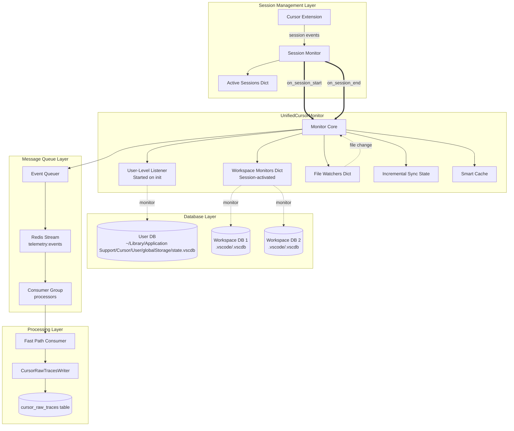
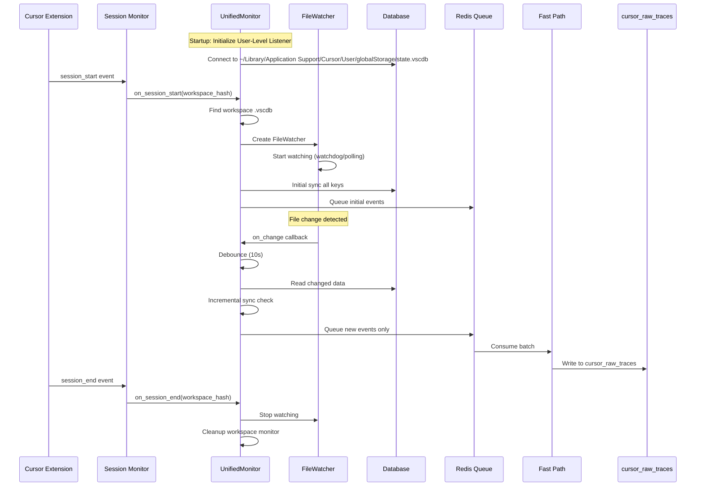
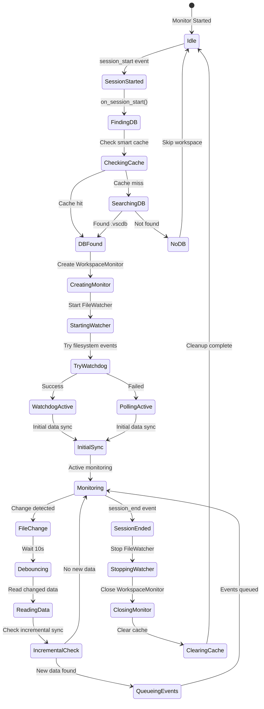

# Comprehensive Specification: Cursor Raw Traces Capture with UnifiedCursorMonitor

## Executive Summary

This comprehensive specification defines a unified monitoring system for Cursor telemetry that:

1. **Consolidates all monitoring** into a single `UnifiedCursorMonitor` replacing separate database and markdown monitors
2. **Uses session-driven workspace activation** - only monitors workspaces with active Cursor sessions
3. **Implements dual-database monitoring** - workspace ItemTable + global cursorDiskKV for complete data capture
4. **Routes ALL changes through Redis message queue** with proper ACK support for at-least-once delivery guarantee
5. **Captures complete composer data** including nested bubble conversations and background composers
6. **Implements file watching with fallback** - primary filesystem events with 1-minute polling fallback
7. **Tracks incremental state** - processes only new/changed data to minimize overhead
8. **Provides event acknowledgment (ACK)** - ensures reliable processing with retry mechanisms and Dead Letter Queue
9. **Reuses existing infrastructure** - Redis streams with consumer groups, XACK support, and fast path processing

**Key Insight**: Cursor stores data across two databases - workspace-level ItemTable contains metadata and references, while global-level cursorDiskKV contains full composer conversations with embedded bubbles. Our solution monitors both locations to capture the complete telemetry picture.

**Critical Decision**: The `raw_traces` table will be deprecated without migration. The new `cursor_raw_traces` table starts fresh with a comprehensive schema designed specifically for Cursor's data model. ALL fields are considered critical and must be captured.

## Architecture Overview

### Monitor Architecture Diagram



### Data Flow Sequence



## Implementation Details

### A. UnifiedCursorMonitor Core

The UnifiedCursorMonitor replaces both CursorDatabaseMonitor and CursorMarkdownMonitor with a session-aware, unified system:

```python
class UnifiedCursorMonitor:
    """
    Unified monitor with session-aware workspace activation.
    Consolidates all Cursor database telemetry monitoring.
    """

    def __init__(
        self,
        redis_client: redis.Redis,
        session_monitor: SessionMonitor,
        config: CursorMonitorConfig
    ):
        # Core dependencies
        self.redis_client = redis_client
        self.session_monitor = session_monitor
        self.config = config

        # Initialize components
        self.user_listener = UserLevelListener(redis_client, config)
        self.event_queuer = EventQueuer(redis_client)
        self.incremental_sync = IncrementalSync()
        self.smart_cache = SmartCache(ttl_seconds=config.cache_ttl)

        # Workspace management
        self.workspace_monitors = {}  # workspace_hash -> WorkspaceMonitor
        self.file_watchers = {}  # workspace_hash -> FileWatcher

        # Keys to monitor in workspace ItemTable
        self.workspace_itemtable_keys = [
            "aiService.generations",
            "aiService.prompts",
            "composer.composerData",
            "workbench.backgroundComposer.workspacePersistentData",
            "workbench.agentMode.exitInfo",
            "interactive.sessions",
            "history.entries",
            "cursorAuth/workspaceOpenedDate",
        ]

        # Patterns to monitor in global cursorDiskKV
        self.global_cursordiskkv_patterns = [
            "composerData:*",  # Full composer data with embedded bubbles
        ]

        # State
        self.running = False
        self.monitoring_task = None

    async def start(self):
        """Start the unified monitor."""
        self.running = True

        # Start user-level listener (runs for entire lifetime)
        await self.user_listener.start()

        # Register session callbacks
        self.session_monitor.on_session_start = self.on_session_start
        self.session_monitor.on_session_end = self.on_session_end

        # Process existing active sessions
        active = self.session_monitor.get_active_workspaces()
        for workspace_hash, session_info in active.items():
            await self.on_session_start(workspace_hash, session_info)

        # Start monitoring loop for fallback polling
        self.monitoring_task = asyncio.create_task(self._monitoring_loop())

        logger.info("UnifiedCursorMonitor started")
```

### B. File Watching Implementation

Hybrid approach: filesystem events with 1-minute polling fallback.

```python
class FileWatcher:
    """
    Watches database files for changes using filesystem events with fallback.

    Strategy:
    1. Primary: watchdog library for filesystem events
    2. Fallback: stat-based polling every 60 seconds
    3. Debounce: 10-second delay after change detection
    """

    def __init__(self, db_path: Path, callback: Callable):
        self.db_path = db_path
        self.callback = callback
        self.last_modified = None
        self.last_size = None
        self.watchdog_observer = None
        self.active = True
        self.debounce_task = None
        self.debounce_delay = 10.0  # seconds

    async def start_watching(self):
        """Start file watching with fallback."""
        # Record initial state
        try:
            stat = self.db_path.stat()
            self.last_modified = stat.st_mtime
            self.last_size = stat.st_size
        except FileNotFoundError:
            logger.warning(f"Database not found: {self.db_path}")
            return

        # Try watchdog first
        if await self._try_watchdog():
            logger.info(f"Using watchdog for {self.db_path}")
        else:
            logger.info(f"Watchdog unavailable, using polling for {self.db_path}")

    async def _try_watchdog(self) -> bool:
        """Try to use watchdog for filesystem events."""
        try:
            from watchdog.observers import Observer
            from watchdog.events import FileSystemEventHandler

            class DBChangeHandler(FileSystemEventHandler):
                def __init__(self, watcher):
                    self.watcher = watcher

                def on_modified(self, event):
                    if event.src_path == str(self.watcher.db_path):
                        asyncio.create_task(
                            self.watcher._handle_change_with_debounce()
                        )

            self.watchdog_observer = Observer()
            self.watchdog_observer.schedule(
                DBChangeHandler(self),
                str(self.db_path.parent),
                recursive=False
            )
            self.watchdog_observer.start()
            return True

        except Exception as e:
            logger.warning(f"Watchdog failed: {e}")
            return False

    async def _handle_change_with_debounce(self):
        """Handle change with debouncing."""
        # Cancel existing debounce task
        if self.debounce_task:
            self.debounce_task.cancel()

        # Schedule new callback after delay
        self.debounce_task = asyncio.create_task(
            self._debounced_callback()
        )

    async def _debounced_callback(self):
        """Execute callback after debounce delay."""
        await asyncio.sleep(self.debounce_delay)
        await self.callback()

    async def check_for_changes(self) -> bool:
        """Polling fallback: check if file changed."""
        try:
            stat = self.db_path.stat()
            changed = (
                stat.st_mtime != self.last_modified or
                stat.st_size != self.last_size
            )
            if changed:
                self.last_modified = stat.st_mtime
                self.last_size = stat.st_size
                return True
        except FileNotFoundError:
            return False
        return False

    async def stop(self):
        """Stop watching and cleanup."""
        self.active = False

        if self.debounce_task:
            self.debounce_task.cancel()

        if self.watchdog_observer:
            self.watchdog_observer.stop()
            self.watchdog_observer.join(timeout=1)
```

### C. User-Level Database Listener

Instantiated on startup, monitors the global Cursor database for ALL workspaces:

```python
class UserLevelListener:
    """
    Monitors user-level Cursor database (~/Library/Application Support/Cursor/User/globalStorage/state.vscdb).
    Started once on UnifiedCursorMonitor startup.
    Remains active for entire monitor lifetime.
    """

    def __init__(self, redis_client: redis.Redis, config: CursorMonitorConfig):
        self.redis_client = redis_client
        self.config = config
        self.db_path = None
        self.connection = None
        self.file_watcher = None
        self.incremental_sync = IncrementalSync()

    async def start(self):
        """Start monitoring user-level database."""
        # Find user database
        self.db_path = await self._find_user_db()
        if not self.db_path or not self.db_path.exists():
            logger.warning("User-level Cursor database not found")
            return

        # Establish connection
        self.connection = await aiosqlite.connect(
            str(self.db_path),
            timeout=self.config.query_timeout
        )
        self.connection.row_factory = aiosqlite.Row

        # Start file watcher
        self.file_watcher = FileWatcher(
            self.db_path,
            self._on_user_db_change
        )
        await self.file_watcher.start_watching()

        # Initial sync
        await self._sync_composer_data()

        logger.info(f"Started user-level listener for {self.db_path}")

    async def _find_user_db(self) -> Optional[Path]:
        """Find user-level Cursor database."""
        # Mac-only path: ~/Library/Application Support/Cursor/User/globalStorage/state.vscdb
        db_path = Path.home() / "Library" / "Application Support" / "Cursor" / "User" / "globalStorage" / "state.vscdb"

        if db_path.exists():
            return db_path

        return None

    async def _on_user_db_change(self):
        """Handle user database changes."""
        try:
            await self._sync_composer_data()
        except Exception as e:
            logger.error(f"Error syncing user database: {e}")

    async def _sync_composer_data(self):
        """
        Sync composer data from global database.
        Only processes composers for active workspaces.
        """
        if not self.connection:
            return

        # Get active workspace hashes from parent monitor
        active_workspaces = self._get_active_workspace_hashes()
        if not active_workspaces:
            return

        # Query composer data
        cursor = await self.connection.execute("""
            SELECT key, value
            FROM cursorDiskKV
            WHERE key LIKE 'composerData:%'
        """)

        rows = await cursor.fetchall()

        for row in rows:
            key = row['key']
            value = row['value']

            if not value:
                continue

            # Check if this composer belongs to an active workspace
            composer_data = json.loads(value)
            workspace_hash = self._extract_workspace_hash(composer_data)

            if workspace_hash not in active_workspaces:
                continue

            # Check if data changed using incremental sync
            if self.incremental_sync.should_process('global', key, value):
                await self._queue_composer_event(key, composer_data)

    def _get_active_workspace_hashes(self) -> Set[str]:
        """Get hashes of active workspaces from parent monitor."""
        # This would be injected or accessed from parent
        return set()

    async def _queue_composer_event(self, key: str, data: dict):
        """Queue composer event to Redis."""
        event = {
            "version": "0.1.0",
            "hook_type": "DatabaseTrace",
            "event_type": "composer",
            "event_id": str(uuid.uuid4()),
            "timestamp": datetime.utcnow().isoformat(),
            "metadata": {
                "storage_level": "global",
                "database_table": "cursorDiskKV",
                "item_key": key,
                "source": "user_level_listener",
            },
            "payload": {
                "extracted_fields": self._extract_composer_fields(data),
                "full_data": data
            }
        }

        await self.event_queuer.queue_event(event)
```

### D. Session Tracking Integration

Only monitors workspaces with active sessions - NO polling or watching of inactive workspaces:

```python
class UnifiedCursorMonitor:
    """Session-aware workspace activation."""

    async def on_session_start(self, workspace_hash: str, session_info: dict):
        """
        Activate monitoring for a workspace when session starts.
        Called by SessionMonitor when a new Cursor session begins.
        """
        logger.info(f"Activating monitoring for workspace {workspace_hash}")

        # Skip if already monitoring
        if workspace_hash in self.workspace_monitors:
            logger.debug(f"Already monitoring workspace {workspace_hash}")
            return

        # Find workspace database
        workspace_path = session_info.get("workspace_path")
        db_path = await self._find_workspace_db(workspace_hash, workspace_path)

        if not db_path or not db_path.exists():
            logger.warning(f"Database not found for workspace {workspace_hash}")
            return

        # Create workspace monitor
        monitor = WorkspaceMonitor(
            workspace_hash=workspace_hash,
            db_path=db_path,
            redis_client=self.redis_client,
            config=self.config,
            itemtable_keys=self.workspace_itemtable_keys
        )
        self.workspace_monitors[workspace_hash] = monitor

        # Start file watcher
        watcher = FileWatcher(
            db_path,
            lambda: self._on_workspace_db_change(workspace_hash)
        )
        await watcher.start_watching()
        self.file_watchers[workspace_hash] = watcher

        # Initial sync of all data
        await monitor.sync_all_data()

        logger.info(f"Activated monitoring for workspace {workspace_hash}")

    async def on_session_end(self, workspace_hash: str):
        """
        Deactivate monitoring when session ends.
        Called by SessionMonitor when a Cursor session terminates.
        """
        logger.info(f"Deactivating monitoring for workspace {workspace_hash}")

        # Stop file watcher
        if workspace_hash in self.file_watchers:
            await self.file_watchers[workspace_hash].stop()
            del self.file_watchers[workspace_hash]

        # Close workspace monitor
        if workspace_hash in self.workspace_monitors:
            await self.workspace_monitors[workspace_hash].close()
            del self.workspace_monitors[workspace_hash]

        # Clear from cache
        self.smart_cache.invalidate(f"{workspace_hash}:*")

        logger.info(f"Deactivated monitoring for workspace {workspace_hash}")

    async def _find_workspace_db(
        self,
        workspace_hash: str,
        workspace_path: Optional[str]
    ) -> Optional[Path]:
        """Find workspace database file."""
        # Use smart cache
        cache_key = f"db_path:{workspace_hash}"
        cached = await self.smart_cache.get(cache_key)
        if cached:
            return Path(cached)

        # Try workspace mapper first
        from ...processing.cursor.workspace_mapper import WorkspaceMapper
        mapper = WorkspaceMapper(self.redis_client)
        mapping = await mapper.get_mapping(workspace_hash)

        if mapping and mapping.db_path:
            db_path = Path(mapping.db_path)
            if db_path.exists():
                await self.smart_cache.set(cache_key, str(db_path))
                return db_path

        # Try workspace path if provided
        if workspace_path:
            workspace_dir = Path(workspace_path)

            # Check .vscode directory
            vscode_db = workspace_dir / ".vscode" / ".vscdb"
            if vscode_db.exists():
                await self.smart_cache.set(cache_key, str(vscode_db))
                return vscode_db

            # Check numbered versions
            for i in range(10):
                vscode_db = workspace_dir / ".vscode" / f"{i}.vscdb"
                if vscode_db.exists():
                    await self.smart_cache.set(cache_key, str(vscode_db))
                    return vscode_db

        return None
```

### E. Message Queue Integration with ACK Support

ALL changes go through Redis streams with proper acknowledgment for at-least-once delivery:

#### E.1 Event Producer (XADD)

```python
class EventQueuer:
    """
    Queues all events to Redis stream for processing.
    Ensures all telemetry flows through the message queue.
    """

    def __init__(self, redis_client: redis.Redis):
        self.redis_client = redis_client
        self.stream_name = "telemetry:events"
        self.max_stream_length = 10000
        self.consumer_group = "processors"

        # Ensure consumer group exists
        self._ensure_consumer_group()

    def _ensure_consumer_group(self):
        """Create consumer group if it doesn't exist."""
        try:
            self.redis_client.xgroup_create(
                self.stream_name,
                self.consumer_group,
                id='0',  # Start from beginning
                mkstream=True  # Create stream if doesn't exist
            )
            logger.info(f"Created consumer group '{self.consumer_group}'")
        except redis.ResponseError as e:
            if "BUSYGROUP" in str(e):
                # Group already exists, that's fine
                pass
            else:
                raise

    async def queue_event(self, event: dict) -> Optional[str]:
        """
        Queue single event to Redis stream.
        Returns the stream entry ID on success.
        """
        try:
            # Serialize nested structures
            serialized = self._serialize_event(event)

            # Add to stream with automatic ID
            # XADD returns the auto-generated ID (timestamp-sequence format)
            entry_id = self.redis_client.xadd(
                self.stream_name,
                serialized,
                maxlen=self.max_stream_length,
                approximate=True
            )

            # Log the entry ID for traceability
            logger.debug(f"Queued event {event.get('event_id')} as stream entry {entry_id}")

            return entry_id

        except Exception as e:
            logger.error(f"Failed to queue event: {e}")
            # Implement local buffering as fallback
            await self._buffer_locally(event)
            return None

    async def queue_events_batch(self, events: List[dict]) -> List[str]:
        """
        Queue multiple events efficiently.
        Returns list of stream entry IDs.
        """
        pipeline = self.redis_client.pipeline()
        entry_ids = []

        for event in events:
            serialized = self._serialize_event(event)
            pipeline.xadd(
                self.stream_name,
                serialized,
                maxlen=self.max_stream_length,
                approximate=True
            )

        try:
            # Execute returns list of entry IDs
            entry_ids = pipeline.execute()
            logger.debug(f"Queued batch of {len(events)} events")
            return entry_ids
        except Exception as e:
            logger.error(f"Failed to queue batch: {e}")
            # Fall back to individual queuing
            for event in events:
                entry_id = await self.queue_event(event)
                if entry_id:
                    entry_ids.append(entry_id)
            return entry_ids

    def _serialize_event(self, event: dict) -> dict:
        """Serialize event for Redis."""
        serialized = {}

        for key, value in event.items():
            if isinstance(value, (dict, list)):
                serialized[key] = json.dumps(value)
            elif isinstance(value, (datetime, date)):
                serialized[key] = value.isoformat()
            elif value is not None:
                serialized[key] = str(value)
            else:
                serialized[key] = ""

        return serialized

    async def _buffer_locally(self, event: dict):
        """Buffer events locally when Redis is unavailable."""
        buffer_path = Path.home() / ".blueplane" / "event_buffer.db"
        buffer_path.parent.mkdir(exist_ok=True)

        async with aiosqlite.connect(str(buffer_path)) as conn:
            await conn.execute("""
                CREATE TABLE IF NOT EXISTS buffered_events (
                    id INTEGER PRIMARY KEY AUTOINCREMENT,
                    timestamp TIMESTAMP DEFAULT CURRENT_TIMESTAMP,
                    event_data TEXT NOT NULL,
                    retry_count INTEGER DEFAULT 0
                )
            """)

            await conn.execute(
                "INSERT INTO buffered_events (event_data) VALUES (?)",
                (json.dumps(event),)
            )
            await conn.commit()
```

#### E.2 Event Consumer with ACK (XREADGROUP + XACK)

```python
class EventConsumer:
    """
    Consumes events from Redis stream with proper ACK handling.
    Implements at-least-once delivery guarantee.
    """

    def __init__(
        self,
        redis_client: redis.Redis,
        stream_name: str = "telemetry:events",
        consumer_group: str = "processors",
        consumer_name: str = None
    ):
        self.redis_client = redis_client
        self.stream_name = stream_name
        self.consumer_group = consumer_group
        self.consumer_name = consumer_name or f"consumer-{os.getpid()}"
        self.max_retries = 3
        self.claim_min_idle_time = 60000  # 60 seconds in milliseconds

    async def consume_events(
        self,
        block_ms: int = 1000,
        count: int = 100
    ) -> List[Tuple[str, dict]]:
        """
        Consume events from stream using consumer group.
        Returns list of (entry_id, event_data) tuples.

        IMPORTANT: Caller MUST acknowledge processed events using ack_events().
        """
        try:
            # Read new messages from the stream
            messages = self.redis_client.xreadgroup(
                self.consumer_group,
                self.consumer_name,
                {self.stream_name: '>'},  # '>' means only new messages
                block=block_ms,
                count=count
            )

            events = []
            if messages:
                for stream_name, stream_messages in messages:
                    for entry_id, data in stream_messages:
                        # Deserialize the data
                        event = self._deserialize_event(data)
                        events.append((entry_id, event))

            return events

        except Exception as e:
            logger.error(f"Error consuming events: {e}")
            return []

    async def ack_events(self, entry_ids: List[str]):
        """
        Acknowledge successful processing of events.
        This removes them from the Pending Entries List (PEL).
        """
        if not entry_ids:
            return

        try:
            # XACK returns the number of messages successfully acknowledged
            ack_count = self.redis_client.xack(
                self.stream_name,
                self.consumer_group,
                *entry_ids
            )

            logger.debug(f"Acknowledged {ack_count}/{len(entry_ids)} events")

            if ack_count < len(entry_ids):
                logger.warning(
                    f"Only {ack_count} of {len(entry_ids)} events were acknowledged. "
                    "Some may have been already ACKed or don't exist."
                )

        except Exception as e:
            logger.error(f"Error acknowledging events: {e}")

    async def process_pending_events(self) -> List[Tuple[str, dict]]:
        """
        Process events that are in the Pending Entries List (PEL).
        These are events that were delivered but not acknowledged.
        """
        try:
            # Get pending events info
            pending_info = self.redis_client.xpending_range(
                self.stream_name,
                self.consumer_group,
                min='-',
                max='+',
                count=100
            )

            stale_events = []
            for entry in pending_info:
                entry_id = entry['message_id']
                idle_time = entry['time_since_delivered']
                delivery_count = entry['times_delivered']
                consumer = entry['consumer']

                # Check if event is stale (idle for too long)
                if idle_time > self.claim_min_idle_time:
                    stale_events.append(entry_id)

                # Check if event exceeded max retries
                if delivery_count > self.max_retries:
                    await self._move_to_dlq(entry_id)
                    # ACK to remove from PEL
                    await self.ack_events([entry_id])

            # Claim and process stale events
            if stale_events:
                claimed = await self._claim_events(stale_events)
                return claimed

            return []

        except Exception as e:
            logger.error(f"Error processing pending events: {e}")
            return []

    async def _claim_events(self, entry_ids: List[str]) -> List[Tuple[str, dict]]:
        """
        Claim ownership of pending events from other consumers.
        Used for recovering stale/abandoned events.
        """
        try:
            # XCLAIM changes ownership of pending messages
            claimed_messages = self.redis_client.xclaim(
                self.stream_name,
                self.consumer_group,
                self.consumer_name,
                min_idle_time=self.claim_min_idle_time,
                message_ids=entry_ids
            )

            events = []
            for entry_id, data in claimed_messages:
                event = self._deserialize_event(data)
                events.append((entry_id, event))

            logger.info(f"Claimed {len(events)} stale events")
            return events

        except Exception as e:
            logger.error(f"Error claiming events: {e}")
            return []

    async def _move_to_dlq(self, entry_id: str):
        """
        Move failed event to Dead Letter Queue (DLQ).
        """
        try:
            # Read the event data
            events = self.redis_client.xrange(
                self.stream_name,
                min=entry_id,
                max=entry_id,
                count=1
            )

            if events:
                _, event_data = events[0]

                # Add to DLQ stream with failure metadata
                dlq_entry = {
                    **event_data,
                    'original_entry_id': entry_id,
                    'moved_to_dlq_at': datetime.utcnow().isoformat(),
                    'stream': self.stream_name,
                    'consumer_group': self.consumer_group
                }

                self.redis_client.xadd(
                    f"{self.stream_name}:dlq",
                    dlq_entry,
                    maxlen=10000,
                    approximate=True
                )

                logger.warning(f"Moved event {entry_id} to DLQ after max retries")

        except Exception as e:
            logger.error(f"Error moving event to DLQ: {e}")

    def _deserialize_event(self, data: dict) -> dict:
        """Deserialize event from Redis."""
        deserialized = {}

        for key, value in data.items():
            key = key.decode() if isinstance(key, bytes) else key
            value = value.decode() if isinstance(value, bytes) else value

            # Try to parse JSON fields
            if key in ['metadata', 'payload', 'extracted_fields']:
                try:
                    deserialized[key] = json.loads(value)
                except json.JSONDecodeError:
                    deserialized[key] = value
            else:
                deserialized[key] = value

        return deserialized

    async def get_consumer_stats(self) -> dict:
        """Get statistics about consumer group and pending messages."""
        try:
            # Get consumer group info
            groups = self.redis_client.xinfo_groups(self.stream_name)
            group_info = next(
                (g for g in groups if g['name'] == self.consumer_group),
                None
            )

            if not group_info:
                return {}

            # Get pending messages summary
            pending_summary = self.redis_client.xpending(
                self.stream_name,
                self.consumer_group
            )

            # Get consumer info
            consumers = self.redis_client.xinfo_consumers(
                self.stream_name,
                self.consumer_group
            )

            return {
                'group': {
                    'name': group_info['name'],
                    'consumers': group_info['consumers'],
                    'pending': group_info['pending'],
                    'last_delivered_id': group_info['last-delivered-id']
                },
                'pending': {
                    'total': pending_summary['pending'],
                    'min_id': pending_summary['min'],
                    'max_id': pending_summary['max'],
                    'consumers': pending_summary.get('consumers', [])
                },
                'consumers': [
                    {
                        'name': c['name'],
                        'pending': c['pending'],
                        'idle': c['idle']
                    }
                    for c in consumers
                ]
            }

        except Exception as e:
            logger.error(f"Error getting consumer stats: {e}")
            return {}
```

#### E.3 Integrated Processing Flow

```python
class CursorEventProcessor:
    """
    Main processor that ties together production and consumption with ACK.
    """

    def __init__(self, redis_client: redis.Redis, db_writer: CursorRawTracesWriter):
        self.redis_client = redis_client
        self.db_writer = db_writer
        self.consumer = EventConsumer(redis_client)
        self.running = True

    async def process_loop(self):
        """
        Main processing loop with proper ACK handling.
        """
        while self.running:
            try:
                # First, check for stale pending events
                stale_events = await self.consumer.process_pending_events()
                if stale_events:
                    await self._process_and_ack(stale_events)

                # Then, consume new events
                events = await self.consumer.consume_events(
                    block_ms=1000,
                    count=100
                )

                if events:
                    await self._process_and_ack(events)

            except Exception as e:
                logger.error(f"Processing loop error: {e}")
                await asyncio.sleep(1)

    async def _process_and_ack(self, events: List[Tuple[str, dict]]):
        """
        Process events and acknowledge them.
        """
        successful_ids = []
        failed_ids = []

        for entry_id, event in events:
            try:
                # Process the event (write to database)
                await self.db_writer.write_event(event)
                successful_ids.append(entry_id)

            except Exception as e:
                logger.error(f"Failed to process event {entry_id}: {e}")
                failed_ids.append(entry_id)

        # ACK successful events
        if successful_ids:
            await self.consumer.ack_events(successful_ids)
            logger.info(f"Processed and ACKed {len(successful_ids)} events")

        # Failed events remain in PEL for retry
        if failed_ids:
            logger.warning(
                f"{len(failed_ids)} events failed processing. "
                "They remain in PEL for retry."
            )
```

### F. Incremental Sync with Last Processed Tracking

```python
class IncrementalSync:
    """
    Tracks last processed state for incremental updates.
    Ensures we only process new or changed data.
    """

    def __init__(self):
        self.last_timestamps = {}  # (storage_level, workspace, key) -> timestamp_ms
        self.last_hashes = {}  # (storage_level, workspace, key) -> content_hash
        self.last_counts = {}  # (storage_level, workspace, key) -> item_count

    def should_process(
        self,
        storage_level: str,
        workspace_hash: str,
        key: str,
        data: Any
    ) -> bool:
        """
        Determine if data should be processed.
        Returns True if data is new or changed.
        """
        cache_key = (storage_level, workspace_hash, key)

        # For timestamped array data (generations, prompts)
        if isinstance(data, list) and key in (
            "aiService.generations",
            "aiService.prompts"
        ):
            # Check if we have new items based on timestamp
            last_ts = self.last_timestamps.get(cache_key, 0)

            new_items = []
            max_ts = last_ts

            for item in data:
                if isinstance(item, dict):
                    item_ts = item.get("unixMs", 0)
                    if item_ts > last_ts:
                        new_items.append(item)
                        max_ts = max(max_ts, item_ts)

            if new_items:
                self.last_timestamps[cache_key] = max_ts
                return True
            return False

        # For non-timestamped data, use content hash
        content_hash = self._compute_hash(data)

        if self.last_hashes.get(cache_key) != content_hash:
            self.last_hashes[cache_key] = content_hash
            return True

        return False

    def get_new_items(
        self,
        storage_level: str,
        workspace_hash: str,
        key: str,
        data: List[dict]
    ) -> List[dict]:
        """Get only new items from timestamped array."""
        cache_key = (storage_level, workspace_hash, key)
        last_ts = self.last_timestamps.get(cache_key, 0)

        new_items = []
        max_ts = last_ts

        for item in data:
            if isinstance(item, dict):
                item_ts = item.get("unixMs", 0)
                if item_ts > last_ts:
                    new_items.append(item)
                    max_ts = max(max_ts, item_ts)

        if new_items:
            self.last_timestamps[cache_key] = max_ts

        return new_items

    def _compute_hash(self, data: Any) -> str:
        """Compute hash of data for change detection."""
        json_str = json.dumps(data, sort_keys=True, default=str)
        return hashlib.sha256(json_str.encode()).hexdigest()

    def clear_workspace(self, workspace_hash: str):
        """Clear state for a workspace (on session end)."""
        keys_to_remove = [
            key for key in self.last_timestamps.keys()
            if key[1] == workspace_hash
        ]
        for key in keys_to_remove:
            del self.last_timestamps[key]

        keys_to_remove = [
            key for key in self.last_hashes.keys()
            if key[1] == workspace_hash
        ]
        for key in keys_to_remove:
            del self.last_hashes[key]
```

### G. Smart Caching Strategy

```python
class SmartCache:
    """
    Intelligent caching to minimize database reads and API calls.
    """

    def __init__(self, ttl_seconds: int = 300):
        self.cache = {}  # key -> (value, timestamp)
        self.ttl = ttl_seconds
        self.lock = asyncio.Lock()

    async def get(self, key: str) -> Optional[Any]:
        """Get from cache if not expired."""
        async with self.lock:
            if key in self.cache:
                value, timestamp = self.cache[key]
                if time.time() - timestamp < self.ttl:
                    return value
                else:
                    del self.cache[key]
        return None

    async def set(self, key: str, value: Any):
        """Set cache value with TTL."""
        async with self.lock:
            self.cache[key] = (value, time.time())

    async def get_or_fetch(
        self,
        key: str,
        fetcher: Callable,
        force_refresh: bool = False
    ) -> Any:
        """Get from cache or fetch if stale."""
        if not force_refresh:
            cached = await self.get(key)
            if cached is not None:
                return cached

        # Fetch fresh data
        value = await fetcher()
        await self.set(key, value)
        return value

    def invalidate(self, pattern: str = None):
        """
        Invalidate cache entries.
        If pattern provided, invalidates matching keys (glob pattern).
        """
        if pattern:
            import fnmatch
            keys_to_remove = [
                k for k in self.cache.keys()
                if fnmatch.fnmatch(k, pattern)
            ]
            for key in keys_to_remove:
                del self.cache[key]
        else:
            self.cache.clear()

    async def cleanup_expired(self):
        """Remove expired entries."""
        now = time.time()
        async with self.lock:
            expired = [
                key for key, (_, ts) in self.cache.items()
                if now - ts >= self.ttl
            ]
            for key in expired:
                del self.cache[key]
```

## Full Composer Data Capture

### Composer Data Structure

The system captures complete composer conversations with nested bubble structure:

```python
class ComposerDataExtractor:
    """
    Extracts complete composer data including nested bubbles.
    Handles both workspace metadata and global conversation data.
    """

    def extract_composer_events(self, composer_data: dict) -> List[dict]:
        """
        Extract all events from a composer conversation.
        Returns list of events: 1 composer event + N bubble events.
        """
        events = []

        # Extract composer-level event
        composer_event = self._extract_composer_event(composer_data)
        events.append(composer_event)

        # Extract bubble events from conversation
        conversation = (
            composer_data.get("conversation", []) or
            composer_data.get("fullConversationHeadersOnly", [])
        )

        for bubble in conversation:
            bubble_event = self._extract_bubble_event(
                bubble,
                composer_data.get("composerId")
            )
            events.append(bubble_event)

        # Extract capability events if present
        capabilities = composer_data.get("capabilitiesRan", {})
        for cap_name, cap_data in capabilities.items():
            cap_event = self._extract_capability_event(
                cap_name,
                cap_data,
                composer_data.get("composerId")
            )
            events.append(cap_event)

        return events

    def _extract_composer_event(self, data: dict) -> dict:
        """Extract composer-level fields."""
        return {
            "event_type": "composer",
            "composer_id": data.get("composerId"),
            "created_at": data.get("createdAt"),
            "last_updated_at": data.get("lastUpdatedAt"),
            "is_agentic": data.get("isAgentic"),
            "is_archived": data.get("isArchived"),
            "has_unread_messages": data.get("hasUnreadMessages"),
            "conversation_count": len(
                data.get("conversation", []) or
                data.get("fullConversationHeadersOnly", [])
            ),
            "total_lines_added": data.get("totalLinesAdded"),
            "total_lines_removed": data.get("totalLinesRemoved"),
            "workspace_persistent_data": data.get("workspacePersistentData"),
        }

    def _extract_bubble_event(self, bubble: dict, composer_id: str) -> dict:
        """Extract data from a single bubble."""
        timing_info = bubble.get("timingInfo", {})

        return {
            "event_type": "bubble",
            "composer_id": composer_id,
            "bubble_id": bubble.get("bubbleId"),
            "server_bubble_id": bubble.get("serverBubbleId"),
            "message_type": bubble.get("type"),  # 1=user, 2=ai
            "text_description": bubble.get("text"),
            "raw_text": bubble.get("rawText"),
            "rich_text": bubble.get("richText"),  # Lexical editor state
            "capabilities_ran": bubble.get("capabilitiesRan"),
            "capability_statuses": bubble.get("capabilityStatuses"),
            "token_count_up_until_here": bubble.get("tokenCountUpUntilHere"),
            "client_start_time": timing_info.get("clientStartTime"),
            "client_end_time": timing_info.get("clientEndTime"),
            "server_start_time": timing_info.get("serverStartTime"),
            "server_end_time": timing_info.get("serverEndTime"),
            "latency_ms": timing_info.get("latencyMs"),
            "selections": bubble.get("selections"),
            "relevant_files": bubble.get("relevantFiles"),
            "is_error": bubble.get("isError", False),
            "error_message": bubble.get("errorMessage"),
        }

    def _extract_capability_event(
        self,
        cap_name: str,
        cap_data: dict,
        composer_id: str
    ) -> dict:
        """Extract capability execution data."""
        return {
            "event_type": "capability",
            "composer_id": composer_id,
            "capability_name": cap_name,
            "capability_type": cap_data.get("type"),
            "status": cap_data.get("status"),
            "duration_ms": cap_data.get("durationMs"),
            "result": cap_data.get("result"),
            "error": cap_data.get("error"),
        }
```

### Background Composer Tracking

```python
class BackgroundComposerExtractor:
    """
    Extracts background composer persistent data.
    Background composers run without user interaction.
    """

    def extract_background_composer(self, data: dict) -> dict:
        """Extract background composer persistent data."""
        return {
            "event_type": "background_composer",
            "workspace_persistent_data": data.get("workspacePersistentData"),
            "last_active_timestamp": data.get("lastActiveTimestamp"),
            "state": data.get("state"),
            "auto_completions": data.get("autoCompletions", []),
            "pending_tasks": data.get("pendingTasks", []),
            "cache_state": data.get("cacheState"),
        }
```

### Agent Mode Capture

```python
class AgentModeExtractor:
    """
    Extracts agent mode session data.
    Agent mode allows Cursor to perform autonomous actions.
    """

    def extract_agent_mode(self, exit_info: dict) -> dict:
        """Extract agent mode exit information."""
        return {
            "event_type": "agent_mode",
            "session_id": exit_info.get("sessionId"),
            "exit_reason": exit_info.get("reason"),
            "exit_timestamp": exit_info.get("timestamp"),
            "duration_ms": exit_info.get("duration"),
            "actions_performed": exit_info.get("actionsPerformed", []),
            "files_modified": exit_info.get("filesModified", []),
            "commands_executed": exit_info.get("commandsExecuted", []),
            "success": exit_info.get("success", False),
            "error_message": exit_info.get("errorMessage"),
        }
```

## Startup and Runtime Behavior

### Startup Sequence

```python
async def startup_sequence():
    """
    UnifiedCursorMonitor startup sequence.
    """
    # 1. Initialize Redis connection
    redis_client = redis.Redis(
        host='localhost',
        port=6379,
        decode_responses=False,  # Binary for compressed data
        max_connections=50
    )

    # 2. Initialize Session Monitor
    session_monitor = SessionMonitor(redis_client)
    await session_monitor.start()

    # 3. Load configuration
    config = CursorMonitorConfig(
        poll_interval=60.0,  # 1 minute fallback
        debounce_delay=10.0,  # 10 second debounce
        query_timeout=1.5,
        cache_ttl=300,  # 5 minute cache
        batch_size=100,
        use_watchdog=True
    )

    # 4. Initialize UnifiedCursorMonitor
    monitor = UnifiedCursorMonitor(
        redis_client=redis_client,
        session_monitor=session_monitor,
        config=config
    )

    # 5. Start user-level listener (runs for lifetime)
    await monitor.start()

    # 6. Process existing active sessions
    # This happens inside monitor.start()

    logger.info("Cursor monitoring system started")

    # 7. Keep running
    try:
        while True:
            await asyncio.sleep(1)
    except KeyboardInterrupt:
        await monitor.stop()
```

### Session Activation Flow



### File Watcher Lifecycle

```python
class FileWatcherLifecycle:
    """
    Manages file watcher lifecycle for each workspace.
    """

    def __init__(self, config: CursorMonitorConfig):
        self.config = config
        self.active_watchers = {}

    async def start_watcher(self, workspace_hash: str, db_path: Path) -> FileWatcher:
        """Start watching a database file."""
        # Create watcher with debounced callback
        watcher = FileWatcher(
            db_path,
            lambda: self.on_change(workspace_hash)
        )

        # Try filesystem events first
        await watcher.start_watching()

        # Start polling loop as fallback
        asyncio.create_task(
            self.polling_loop(workspace_hash, watcher)
        )

        self.active_watchers[workspace_hash] = watcher
        return watcher

    async def polling_loop(self, workspace_hash: str, watcher: FileWatcher):
        """
        1-minute polling fallback for file changes.
        Runs even if watchdog is active as safety net.
        """
        while watcher.active:
            await asyncio.sleep(self.config.poll_interval)  # 60 seconds

            if watcher.active and await watcher.check_for_changes():
                await watcher._handle_change_with_debounce()

    async def stop_watcher(self, workspace_hash: str):
        """Stop watching and cleanup."""
        if workspace_hash in self.active_watchers:
            watcher = self.active_watchers[workspace_hash]
            await watcher.stop()
            del self.active_watchers[workspace_hash]

    async def on_change(self, workspace_hash: str):
        """Handle file change for workspace."""
        # This would trigger data reading in the monitor
        pass
```

### Monitoring Loop (Fallback)

```python
async def _monitoring_loop(self):
    """
    Main monitoring loop for fallback polling.
    Runs continuously even with file watchers as safety net.
    """
    while self.running:
        try:
            # Check all active workspaces
            for workspace_hash in list(self.workspace_monitors.keys()):
                monitor = self.workspace_monitors.get(workspace_hash)
                if not monitor:
                    continue

                # Check if file watcher missed a change
                watcher = self.file_watchers.get(workspace_hash)
                if watcher and await watcher.check_for_changes():
                    await self._on_workspace_db_change(workspace_hash)

            # Check user-level database
            if self.user_listener:
                await self.user_listener.check_for_changes()

            # Cleanup expired cache entries
            await self.smart_cache.cleanup_expired()

        except Exception as e:
            logger.error(f"Monitoring loop error: {e}")

        # Wait for next poll interval
        await asyncio.sleep(self.config.poll_interval)
```

## What Changes vs What Stays

### Components to Reuse (Existing Infrastructure)

| Component | Location | Purpose | Changes Needed |
|-----------|----------|---------|----------------|
| Redis Streams | `telemetry:events` | Message queue with at-least-once delivery | Add ACK support (XACK) |
| Consumer Groups | `processors` group | Event processing with PEL support | Add proper ACK handling |
| XREADGROUP/XACK | Redis native | Reliable message consumption | Implement in consumers |
| Event Consumer | `src/processing/cursor/event_consumer.py` | Batch processing | Add ACK after successful writes |
| Session Monitor | `src/processing/cursor/session_monitor.py` | Session tracking | Add callbacks for on_session_start/end |
| CDC Publisher | `src/processing/common/cdc_publisher.py` | Change data capture | None |
| SQLite Writer | `src/processing/database/writer.py` | Batch writes | Add cursor_raw_traces support |
| zlib Compression | Level 6 | Event data compression | None |

### New Components to Build

| Component | Purpose | Dependencies |
|-----------|---------|--------------|
| `UnifiedCursorMonitor` | Main orchestrator | Session Monitor, Redis |
| `UserLevelListener` | Global DB monitoring | Redis, aiosqlite |
| `FileWatcher` | Change detection | watchdog library |
| `WorkspaceMonitor` | Per-workspace monitoring | aiosqlite, Redis |
| `EventQueuer` | Message queue interface | Redis |
| `IncrementalSync` | State tracking | None |
| `SmartCache` | Performance optimization | None |
| `ComposerDataExtractor` | Composer parsing | None |
| `CursorRawTracesWriter` | Table writer | SQLite |

### Components to Deprecate

| Component | Replacement | Timeline |
|-----------|-------------|----------|
| `CursorDatabaseMonitor` | UnifiedCursorMonitor | Immediate |
| `CursorMarkdownMonitor` | UnifiedCursorMonitor | Immediate |
| `raw_traces` table usage | cursor_raw_traces | After validation |
| Direct polling | File watching + fallback | Immediate |
| Global deduplication | Per-workspace incremental sync | Immediate |

## Error Handling

### Comprehensive Error Strategy

```python
class ErrorHandler:
    """
    Comprehensive error handling for all monitor operations.
    """

    def __init__(self):
        self.error_counts = {}  # error_type -> count
        self.last_errors = {}  # error_type -> (timestamp, error)

    async def handle_database_error(
        self,
        error: Exception,
        workspace_hash: str,
        operation: str
    ) -> str:
        """
        Handle database access errors.
        Returns: 'retry', 'skip', or 'fatal'
        """
        error_str = str(error).lower()

        if "locked" in error_str:
            # Database locked - retry with backoff
            logger.warning(f"Database locked for {workspace_hash}, will retry")
            await asyncio.sleep(1.0)
            return "retry"

        elif "no such table" in error_str:
            # Table doesn't exist - skip this key
            logger.debug(f"Table not found for {workspace_hash}: {operation}")
            return "skip"

        elif "permission denied" in error_str:
            # Permission issue - log and skip
            logger.error(f"Permission denied for {workspace_hash}")
            self._record_error("permission", error)
            return "skip"

        elif "corrupt" in error_str:
            # Database corruption - fatal for this workspace
            logger.critical(f"Database corruption detected for {workspace_hash}")
            self._record_error("corruption", error)
            return "fatal"

        else:
            # Unknown error - log and continue
            logger.error(f"Database error for {workspace_hash}: {error}")
            self._record_error("unknown_db", error)
            return "skip"

    async def handle_queue_error(
        self,
        error: Exception,
        event: dict
    ) -> str:
        """
        Handle Redis queue errors.
        Returns: 'retry', 'buffer', or 'drop'
        """
        if isinstance(error, redis.ConnectionError):
            # Connection error - buffer locally
            logger.error("Redis connection lost, buffering locally")
            await self.buffer_event_locally(event)
            return "buffer"

        elif isinstance(error, redis.ResponseError):
            # Redis error - log and drop
            logger.error(f"Redis response error: {error}")
            self._record_error("redis_response", error)
            return "drop"

        else:
            # Other error - retry once
            logger.warning(f"Queue error, will retry: {error}")
            return "retry"

    async def handle_file_watcher_error(
        self,
        error: Exception,
        db_path: Path
    ) -> str:
        """
        Handle file watching errors.
        Returns: 'fallback' or 'continue'
        """
        if "watchdog" in str(error).lower():
            # Watchdog failed - use polling
            logger.info(f"Watchdog failed for {db_path}, using polling")
            return "fallback"
        else:
            # Other error - continue with polling
            logger.warning(f"File watcher error for {db_path}: {error}")
            return "continue"

    async def buffer_event_locally(self, event: dict):
        """
        Buffer events locally when Redis is unavailable.
        Uses a local SQLite buffer.
        """
        buffer_path = Path.home() / ".blueplane" / "event_buffer.db"
        buffer_path.parent.mkdir(exist_ok=True)

        async with aiosqlite.connect(str(buffer_path)) as conn:
            await conn.execute("""
                CREATE TABLE IF NOT EXISTS buffered_events (
                    id INTEGER PRIMARY KEY AUTOINCREMENT,
                    timestamp TIMESTAMP DEFAULT CURRENT_TIMESTAMP,
                    event_data TEXT NOT NULL
                )
            """)

            await conn.execute(
                "INSERT INTO buffered_events (event_data) VALUES (?)",
                (json.dumps(event),)
            )
            await conn.commit()

    def _record_error(self, error_type: str, error: Exception):
        """Record error for monitoring."""
        self.error_counts[error_type] = self.error_counts.get(error_type, 0) + 1
        self.last_errors[error_type] = (datetime.utcnow(), str(error))

        # Emit metrics if available
        if hasattr(self, 'metrics_client'):
            self.metrics_client.increment(f"cursor_monitor.error.{error_type}")
```

### Graceful Degradation

```python
class GracefulDegradation:
    """
    Ensures system continues operating under failure conditions.
    """

    async def with_fallback(
        self,
        primary: Callable,
        fallback: Callable,
        error_msg: str
    ):
        """Execute with fallback on failure."""
        try:
            return await primary()
        except Exception as e:
            logger.warning(f"{error_msg}: {e}, using fallback")
            try:
                return await fallback()
            except Exception as fallback_error:
                logger.error(f"Fallback also failed: {fallback_error}")
                return None

    async def find_database_with_fallback(
        self,
        workspace_hash: str,
        workspace_path: Optional[str]
    ) -> Optional[Path]:
        """Find database with multiple fallback strategies."""
        return await self.with_fallback(
            primary=lambda: self._find_vscode_db(workspace_hash),
            fallback=lambda: self._find_cursor_db(workspace_path),
            error_msg="Failed to find .vscode DB"
        )

    async def read_data_with_retry(
        self,
        connection: aiosqlite.Connection,
        query: str,
        params: tuple,
        max_retries: int = 3
    ):
        """Read data with automatic retry."""
        for attempt in range(max_retries):
            try:
                cursor = await connection.execute(query, params)
                return await cursor.fetchall()
            except Exception as e:
                if attempt == max_retries - 1:
                    raise
                await asyncio.sleep(2 ** attempt)  # Exponential backoff
```

## Configuration

### Complete Configuration Schema

```yaml
unified_cursor_monitor:
  # Timing Configuration
  timing:
    poll_interval: 60.0           # Fallback polling (1 minute)
    debounce_delay: 10.0          # Debounce after file change
    query_timeout: 1.5            # Database query timeout
    startup_delay: 5.0            # Delay before starting monitoring

  # Batching Configuration
  batching:
    batch_size: 100               # Events per batch
    batch_timeout: 0.1            # 100ms batch timeout
    compression_level: 6          # zlib compression level

  # Caching Configuration
  caching:
    cache_ttl: 300                # Cache TTL (5 minutes)
    cache_max_size: 1000          # Max cache entries

  # File Watching
  file_watching:
    use_watchdog: true            # Try filesystem events
    watchdog_recursive: false     # Don't watch recursively
    fallback_to_polling: true     # Use polling if watchdog fails

  # Keys to Monitor
  workspace_itemtable_keys:
    - "aiService.generations"
    - "aiService.prompts"
    - "composer.composerData"
    - "workbench.backgroundComposer.workspacePersistentData"
    - "workbench.agentMode.exitInfo"
    - "interactive.sessions"
    - "history.entries"
    - "cursorAuth/workspaceOpenedDate"

  global_cursordiskkv_patterns:
    - "composerData:*"

  # Message Queue & ACK Settings
  message_queue:
    consumer_group: "processors"
    consumer_name_prefix: "consumer"
    max_retries: 3                # Max delivery attempts before DLQ
    claim_min_idle_time: 60000    # 60 seconds in milliseconds
    pending_check_interval: 30    # Check PEL every 30 seconds
    ack_batch_size: 100           # ACK events in batches
    dlq_enabled: true             # Enable Dead Letter Queue
    dlq_max_length: 10000         # Max DLQ size

  # Error Handling
  error_handling:
    max_retries: 3
    retry_backoff: 2.0            # Exponential backoff multiplier
    buffer_on_redis_failure: true # Buffer events locally

  # Performance Tuning
  performance:
    max_connections_per_workspace: 1
    connection_pool_size: 10
    redis_max_connections: 50

  # Monitoring
  monitoring:
    emit_metrics: true
    metrics_interval: 60          # Emit metrics every minute
    log_level: "INFO"
```

## Cursor Raw Traces Table Schema

The complete schema for cursor_raw_traces table capturing ALL critical fields:

```sql
CREATE TABLE IF NOT EXISTS cursor_raw_traces (
    -- Primary key and ingestion metadata
    sequence INTEGER PRIMARY KEY AUTOINCREMENT,
    ingested_at TIMESTAMP DEFAULT CURRENT_TIMESTAMP,

    -- Event identification (indexed for queries)
    event_id TEXT NOT NULL,                    -- Generated UUID for this trace
    external_session_id TEXT,                  -- Cursor session ID
    event_type TEXT NOT NULL,                  -- 'generation', 'prompt', 'composer', 'bubble', etc.
    timestamp TIMESTAMP NOT NULL,              -- ISO format timestamp

    -- Source location metadata
    storage_level TEXT NOT NULL,               -- 'workspace' or 'global'
    workspace_hash TEXT NOT NULL,              -- SHA256 hash of workspace path
    database_table TEXT NOT NULL,              -- 'ItemTable' or 'cursorDiskKV'
    item_key TEXT NOT NULL,                    -- Key in table

    -- AI Service fields
    generation_uuid TEXT,                      -- From generationUUID field
    generation_type TEXT,                      -- 'cmdk', 'composer', etc.
    command_type TEXT,                         -- From prompts commandType field

    -- Composer/Bubble fields
    composer_id TEXT,                          -- Composer UUID
    bubble_id TEXT,                            -- Bubble UUID
    server_bubble_id TEXT,                     -- Server-side bubble ID
    message_type INTEGER,                      -- 1=user, 2=ai
    is_agentic BOOLEAN,                        -- From isAgentic field

    -- Content fields
    text_description TEXT,                     -- From textDescription or text field
    raw_text TEXT,                             -- Plain text content
    rich_text TEXT,                            -- Lexical editor state (JSON string)

    -- Timing fields (milliseconds)
    unix_ms INTEGER,                           -- Original timestamp from Cursor
    created_at INTEGER,                        -- Creation timestamp
    last_updated_at INTEGER,                   -- Last update timestamp
    completed_at INTEGER,                      -- Completion timestamp
    client_start_time INTEGER,                 -- From timingInfo.clientStartTime
    client_end_time INTEGER,                   -- From timingInfo.clientEndTime

    -- Metrics fields
    lines_added INTEGER,                       -- Total lines added
    lines_removed INTEGER,                     -- Total lines removed
    token_count_up_until_here INTEGER,         -- Cumulative token count

    -- Capability/Tool fields
    capabilities_ran TEXT,                     -- JSON dict of capabilities executed
    capability_statuses TEXT,                  -- JSON dict of capability statuses

    -- Context fields
    project_name TEXT,                         -- Extracted workspace name
    relevant_files TEXT,                       -- JSON array of relevant files
    selections TEXT,                           -- JSON array of selections

    -- Status fields
    is_archived BOOLEAN,                       -- Composer archived status
    has_unread_messages BOOLEAN,               -- Composer unread messages flag

    -- Full event payload (compressed)
    event_data BLOB NOT NULL,                  -- zlib level 6 compressed JSON

    -- Partitioning columns (generated)
    event_date DATE GENERATED ALWAYS AS (DATE(timestamp)),
    event_hour INTEGER GENERATED ALWAYS AS (CAST(strftime('%H', timestamp) AS INTEGER))
);

-- Performance indexes
CREATE INDEX idx_cursor_session_time ON cursor_raw_traces(external_session_id, timestamp)
    WHERE external_session_id IS NOT NULL;
CREATE INDEX idx_cursor_event_type_time ON cursor_raw_traces(event_type, timestamp);
CREATE INDEX idx_cursor_workspace ON cursor_raw_traces(workspace_hash, timestamp);
CREATE INDEX idx_cursor_generation ON cursor_raw_traces(generation_uuid)
    WHERE generation_uuid IS NOT NULL;
CREATE INDEX idx_cursor_composer ON cursor_raw_traces(composer_id, timestamp)
    WHERE composer_id IS NOT NULL;
CREATE INDEX idx_cursor_bubble ON cursor_raw_traces(bubble_id)
    WHERE bubble_id IS NOT NULL;
CREATE INDEX idx_cursor_storage_key ON cursor_raw_traces(storage_level, database_table, item_key);
CREATE INDEX idx_cursor_date_hour ON cursor_raw_traces(event_date, event_hour);
CREATE INDEX idx_cursor_unix_ms ON cursor_raw_traces(unix_ms DESC)
    WHERE unix_ms IS NOT NULL;
```

## Performance Characteristics

### Target Metrics

| Operation | Target Latency | Notes |
|-----------|---------------|-------|
| Session activation | <100ms | Find DB, create monitor, start watcher |
| File change detection | <1s (watchdog) / <60s (polling) | Debounced by 10s |
| Event queuing (XADD) | <10ms per event | Returns entry ID for tracking |
| Event consumption (XREADGROUP) | <5ms per 100 events | Batch read with PEL tracking |
| Event acknowledgment (XACK) | <5ms per 100 events | Batch ACK after successful processing |
| PEL recovery (XCLAIM) | <10ms per claim | Recover stale events from crashed consumers |
| Batch processing | <10ms per 100 events | Pipelined Redis operations |
| Database query | <1.5s | Timeout enforced |
| Memory per workspace | <50MB | Connection + cache + state |
| CPU usage | <5% baseline | Spike to 15% during sync |

### Optimization Strategies

1. **Lazy Loading**: Database connections created only when needed
2. **Smart Caching**: TTL-based cache with automatic expiry
3. **Incremental Sync**: Process only new/changed data
4. **Debounced Operations**: 10s delay prevents rapid re-reads
5. **Session-Driven**: No resources used for inactive workspaces
6. **Batch Processing**: Queue events in batches of 100
7. **Connection Pooling**: Reuse database connections
8. **Binary Redis Protocol**: More efficient for large payloads

## Testing Strategy

### Unit Tests

```python
# Test file watching with mock filesystem
async def test_file_watcher_detects_changes():
    mock_path = Path("/mock/db.vscdb")
    callback_called = False

    async def callback():
        nonlocal callback_called
        callback_called = True

    watcher = FileWatcher(mock_path, callback)
    # Simulate file change
    await watcher._handle_change_with_debounce()
    await asyncio.sleep(11)  # Wait for debounce

    assert callback_called

# Test incremental sync
def test_incremental_sync_filters_old_data():
    sync = IncrementalSync()

    data = [
        {"unixMs": 1000, "text": "old"},
        {"unixMs": 2000, "text": "new"}
    ]

    # First call gets all
    assert sync.should_process("workspace", "hash", "key", data)

    # Second call gets none (no new data)
    assert not sync.should_process("workspace", "hash", "key", data)

    # Add new item
    data.append({"unixMs": 3000, "text": "newer"})
    assert sync.should_process("workspace", "hash", "key", data)
```

### Integration Tests

```python
# Test session activation flow
async def test_session_activation():
    monitor = UnifiedCursorMonitor(redis_client, session_monitor, config)

    # Simulate session start
    await monitor.on_session_start("workspace_hash", {"workspace_path": "/test"})

    assert "workspace_hash" in monitor.workspace_monitors
    assert "workspace_hash" in monitor.file_watchers

# Test end-to-end data flow
async def test_data_flow():
    # Start monitor
    monitor = await create_test_monitor()

    # Simulate file change
    test_db = create_test_database()
    add_test_generation(test_db)

    # Wait for processing
    await asyncio.sleep(15)  # Debounce + processing

    # Verify event in Redis
    events = redis_client.xrange("telemetry:events", "-", "+")
    assert len(events) > 0
```

### Performance Tests

```python
# Benchmark with large dataset
async def test_performance_with_1000_generations():
    monitor = await create_test_monitor()

    # Add 1000 generations
    generations = [create_test_generation(i) for i in range(1000)]

    start = time.time()
    await monitor.process_generations(generations)
    elapsed = time.time() - start

    assert elapsed < 1.0  # Should process in under 1 second

# Test memory usage
def test_memory_usage():
    import psutil
    process = psutil.Process()

    initial_memory = process.memory_info().rss / 1024 / 1024  # MB

    # Create monitors for 10 workspaces
    monitors = []
    for i in range(10):
        monitor = create_workspace_monitor(f"workspace_{i}")
        monitors.append(monitor)

    final_memory = process.memory_info().rss / 1024 / 1024  # MB
    memory_per_workspace = (final_memory - initial_memory) / 10

    assert memory_per_workspace < 50  # Less than 50MB per workspace
```

## Migration Notes

### No Migration Required

- **Fresh Start**: cursor_raw_traces table is created new
- **No Data Transfer**: raw_traces data is not migrated
- **Parallel Operation**: Can run alongside old monitors initially
- **Gradual Cutover**: Disable old monitors after validation
- **Clean Deprecation**: Remove old code after successful deployment

### Deployment Timeline

1. **Week 1**: Deploy UnifiedCursorMonitor in shadow mode
2. **Week 2**: Validate data completeness and performance
3. **Week 3**: Switch consumers to cursor_raw_traces
4. **Week 4**: Deprecate old monitors and raw_traces table

## Summary

This comprehensive specification provides a complete implementation guide for the UnifiedCursorMonitor system with:

- **Session-driven workspace monitoring** - only active workspaces consume resources
- **File watching with fallback** - robust change detection with filesystem events
- **Complete composer data capture** - nested bubbles and all metadata
- **Incremental sync** - process only new/changed data
- **Smart caching** - minimize database reads with TTL-based cache
- **At-least-once delivery guarantee** - Redis Streams with consumer groups and ACK support
- **Reliable event processing** - XREADGROUP/XACK with Pending Entries List (PEL) management
- **Automatic retry mechanism** - Failed events retry with exponential backoff
- **Dead Letter Queue (DLQ)** - Permanent storage for events that exceed max retries
- **Reuse of existing infrastructure** - Redis streams, consumer groups, XACK protocol
- **Comprehensive error handling** - graceful degradation with local buffering
- **No migration needed** - fresh start with cursor_raw_traces table

The system ensures reliable event processing through:
1. **XADD** returns entry IDs for traceability
2. **XREADGROUP** delivers events to consumers with PEL tracking
3. **XACK** confirms successful processing and removes from PEL
4. **XCLAIM** recovers stale events from crashed consumers
5. **DLQ** captures permanently failed events for manual review

The system is designed for high performance, reliability, and maintainability while capturing ALL critical Cursor telemetry data with guaranteed delivery.