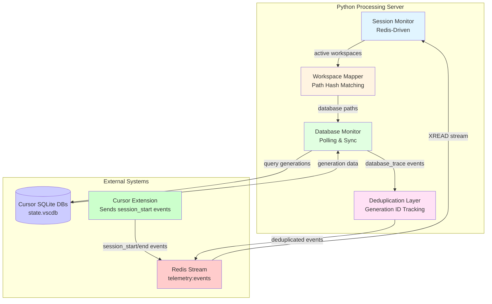

# Database Monitor Refactor: TypeScript → Python (Option 2 - Production-Ready)

**Proposed**: November 11, 2025  
**Status**: Design Proposal - Option 2 (Improved Python-Only)  
**Approach**: Address all critical concerns with robust implementation

---

## Overview

Refactor database monitoring from TypeScript extension to Python processing server with **comprehensive error handling, deduplication, and simple workspace mapping**.

### Design Principles

1. **Redis Events as Primary Source**: Use `session_start` events from Redis (not session files)
2. **Simple Workspace Mapping**: Workspace path hash matching only
3. **Zero-Impact on Cursor**: Aggressive timeouts, read-only, non-blocking
4. **Hardcoded Schema**: Assumes `aiService.generations` table (v1 schema)
5. **Built-in Deduplication**: Prevent duplicate events from hooks + monitor
6. **Production-Ready**: Comprehensive error handling, retries, health checks

---

## Architecture



### Component Details

**Session Monitor**

- Listens to `session_start` and `session_end` events from Redis stream
- Tracks active workspaces with metadata (session_id, workspace_hash, workspace_path)
- Provides workspace information to Database Monitor

**Workspace Mapper**

- Maps `workspace_hash` to `state.vscdb` file paths using workspace path hash matching
- Hashes workspace path (SHA256, first 16 chars) and matches against database directory names
- Searches database contents for workspace path if directory name doesn't match
- Caches mappings persistently

**Database Monitor**

- Opens read-only connections with aggressive timeouts (1-2s)
- Uses hardcoded table name: `aiService.generations` (assumes v1 schema)
- Syncs on session start (last 24 hours)
- Incremental polling every 30 seconds
- Retries with exponential backoff on errors
- Processes generations and sends to Redis

**Deduplication Layer**

- Tracks seen `generation_id` + `session_id` pairs
- Prevents duplicate events from hooks + monitor
- TTL-based cleanup (24 hour window)

---

## Implementation

### 1. Session Monitor (`src/processing/cursor/session_monitor.py`)

**Key Feature**: Redis events as the only source for session tracking.

```python
"""
Session Monitor for Cursor workspaces.

Listens to Redis session_start/end events from the extension.
"""

import asyncio
import json
import hashlib
import logging
from pathlib import Path
from typing import Dict, Optional, Set
from datetime import datetime, timedelta
import redis

logger = logging.getLogger(__name__)


class SessionMonitor:
    """
    Monitor Cursor sessions via Redis events.

    Design:
    - Redis stream events are the only source (extension required)
    - Tracks active workspaces with metadata
    """

    def __init__(self, redis_client: redis.Redis):
        self.redis_client = redis_client
        self.session_dir = Path.home() / ".blueplane" / "cursor-session"

        # Active sessions: workspace_hash -> session_info
        self.active_sessions: Dict[str, dict] = {}

        # Track last processed Redis message ID (for resuming)
        self.last_redis_id = "0-0"

        # Session file watcher (fallback only)
        self.use_file_watcher = False
        self.running = False

    async def start(self):
        """Start monitoring sessions."""
        self.running = True

        # PRIMARY: Start Redis event listener
        asyncio.create_task(self._listen_redis_events())

        # FALLBACK: Check if session files exist (extension installed)
        if self.session_dir.exists():
            await self._scan_session_files()
            self.use_file_watcher = True
            asyncio.create_task(self._watch_session_files())

        logger.info("Session monitor started (Redis primary, files fallback)")

    async def stop(self):
        """Stop monitoring."""
        self.running = False
        logger.info("Session monitor stopped")

    async def _listen_redis_events(self):
        """
        PRIMARY: Listen to session_start/end events from Redis stream.

        Reads from telemetry:events stream, filters for session events.
        More reliable than file watching.
        """
        try:
            while self.running:
                try:
                    # Read from stream (non-blocking, 1 second timeout)
                    messages = self.redis_client.xread(
                        {"telemetry:events": self.last_redis_id},
                        count=100,
                        block=1000  # 1 second block
                    )

                    if not messages:
                        await asyncio.sleep(0.1)
                        continue

                    # Process messages
                    for stream, msgs in messages:
                        for msg_id, fields in msgs:
                            await self._process_redis_message(msg_id, fields)
                            self.last_redis_id = msg_id.decode() if isinstance(msg_id, bytes) else str(msg_id)

                except redis.ConnectionError:
                    logger.warning("Redis connection lost, retrying...")
                    await asyncio.sleep(5)
                except Exception as e:
                    logger.error(f"Error reading Redis events: {e}")
                    await asyncio.sleep(1)

        except Exception as e:
            logger.error(f"Redis event listener failed: {e}")

    async def _process_redis_message(self, msg_id: str, fields: dict):
        """Process a Redis message and update session state."""
        try:
            # Decode fields
            event_type = self._decode_field(fields, 'event_type')
            hook_type = self._decode_field(fields, 'hook_type')

            # Only process session events
            if event_type not in ('session_start', 'session_end'):
                return

            # Parse payload
            payload_str = self._decode_field(fields, 'payload')
            if payload_str:
                payload = json.loads(payload_str)
            else:
                payload = {}

            # Parse metadata
            metadata_str = self._decode_field(fields, 'metadata')
            if metadata_str:
                metadata = json.loads(metadata_str)
            else:
                metadata = {}

            workspace_hash = metadata.get('workspace_hash') or payload.get('workspace_hash')
            session_id = payload.get('session_id') or metadata.get('session_id')
            workspace_path = payload.get('workspace_path', '')

            if not workspace_hash or not session_id:
                logger.debug(f"Incomplete session event: {msg_id}")
                return

            if event_type == 'session_start':
                self.active_sessions[workspace_hash] = {
                    "session_id": session_id,
                    "workspace_hash": workspace_hash,
                    "workspace_path": workspace_path,
                    "started_at": datetime.utcnow().isoformat(),
                    "source": "redis",  # Track source for debugging
                }
                logger.info(f"Session started: {workspace_hash} -> {session_id}")

            elif event_type == 'session_end':
                if workspace_hash in self.active_sessions:
                    del self.active_sessions[workspace_hash]
                    logger.info(f"Session ended: {workspace_hash}")

        except Exception as e:
            logger.error(f"Error processing Redis message {msg_id}: {e}")

    def _decode_field(self, fields: dict, key: str) -> str:
        """Decode a field from Redis message."""
        value = fields.get(key.encode() if isinstance(key, str) else key)
        if value is None:
            return ""
        if isinstance(value, bytes):
            return value.decode('utf-8')
        return str(value)

    async def _scan_session_files(self):
        """FALLBACK: Scan existing session files."""
        if not self.session_dir.exists():
            return

        for session_file in self.session_dir.glob("*.json"):
            try:
                with open(session_file) as f:
                    data = json.load(f)

                workspace_hash = session_file.stem
                session_id = data.get("CURSOR_SESSION_ID")

                if session_id and workspace_hash not in self.active_sessions:
                    # Only add if not already from Redis
                    self.active_sessions[workspace_hash] = {
                        "session_id": session_id,
                        "workspace_hash": workspace_hash,
                        "workspace_path": data.get("workspace_path", ""),
                        "source": "file",  # Track source
                    }
                    logger.debug(f"Loaded session from file: {workspace_hash}")
            except Exception as e:
                logger.debug(f"Could not load session file {session_file}: {e}")

    async def _watch_session_files(self):
        """FALLBACK: Watch session files for changes."""
        # Simple polling approach (more reliable than file watching)
        while self.running:
            await self._scan_session_files()
            await asyncio.sleep(10)  # Poll every 10 seconds

    def get_active_workspaces(self) -> Dict[str, dict]:
        """Get currently active workspaces."""
        return self.active_sessions.copy()

    def get_workspace_path(self, workspace_hash: str) -> Optional[str]:
        """Get workspace path for hash."""
        session = self.active_sessions.get(workspace_hash)
        return session.get("workspace_path") if session else None
```

---

### 2. Workspace Mapper (`src/processing/cursor/workspace_mapper.py`)

**Key Feature**: Workspace path hash matching to find database files.

```python
"""
Workspace-to-Database Mapper.

Maps workspace_hash to state.vscdb files using workspace path hash matching.
"""

import asyncio
import hashlib
import json
import logging
from pathlib import Path
from typing import Dict, Optional, List
import aiosqlite

logger = logging.getLogger(__name__)


class WorkspaceMapper:
    """
    Map workspace_hash to database files using workspace path hash matching.

    Strategy:
    1. Hash workspace path (SHA256, first 16 chars)
    2. Match against database directory names
    3. Search database contents if directory name doesn't match
    4. Cache successful mappings
    """

    def __init__(self, session_monitor):
        self.session_monitor = session_monitor
        self.mapping_cache: Dict[str, Path] = {}  # workspace_hash -> db_path
        self.cache_file = Path.home() / ".blueplane" / "workspace_db_cache.json"
        self._load_cache()

    def _load_cache(self):
        """Load cached mappings from disk."""
        if self.cache_file.exists():
            try:
                with open(self.cache_file) as f:
                    cache_data = json.load(f)
                    for workspace_hash, db_path_str in cache_data.items():
                        db_path = Path(db_path_str)
                        if db_path.exists():
                            self.mapping_cache[workspace_hash] = db_path
                logger.info(f"Loaded {len(self.mapping_cache)} cached mappings")
            except Exception as e:
                logger.warning(f"Failed to load cache: {e}")

    def _save_cache(self):
        """Save mappings to disk."""
        try:
            cache_data = {
                hash: str(path)
                for hash, path in self.mapping_cache.items()
            }
            self.cache_file.parent.mkdir(parents=True, exist_ok=True)
            with open(self.cache_file, 'w') as f:
                json.dump(cache_data, f)
        except Exception as e:
            logger.warning(f"Failed to save cache: {e}")

    async def find_database(
        self,
        workspace_hash: str,
        workspace_path: Optional[str] = None
    ) -> Optional[Path]:
        """
        Find database file for workspace using path hash matching.

        Returns:
            Path to state.vscdb or None if not found
        """
        # Check cache first
        if workspace_hash in self.mapping_cache:
            cached_path = self.mapping_cache[workspace_hash]
            if cached_path.exists():
                return cached_path
            else:
                # Cache invalid, remove it
                del self.mapping_cache[workspace_hash]

        # Workspace path hash matching
        if workspace_path:
            db_path = await self._match_by_path_hash(workspace_path)
            if db_path:
                self.mapping_cache[workspace_hash] = db_path
                self._save_cache()
                return db_path

        logger.debug(f"Could not map workspace {workspace_hash}")
        return None

    async def _match_by_path_hash(self, workspace_path: str) -> Optional[Path]:
        """
        Hash workspace path and match against database directories.

        Cursor stores databases in workspaceStorage/{uuid}/state.vscdb
        We hash the workspace path and try to match it.
        """
        # Hash workspace path (same algorithm as extension)
        workspace_hash_obj = hashlib.sha256(workspace_path.encode())
        workspace_hash_hex = workspace_hash_obj.hexdigest()[:16]

        # Search all database directories
        for db_path in self._discover_all_databases():
            # Check if directory name or parent matches hash pattern
            # (Cursor may use hash-like UUIDs)
            parent_dir = db_path.parent.name

            # Try exact match first
            if workspace_hash_hex in parent_dir.lower():
                return db_path

            # Try checking database contents for workspace path
            if await self._db_contains_path(db_path, workspace_path):
                return db_path

        return None

    async def _db_contains_path(self, db_path: Path, workspace_path: str) -> bool:
        """Check if database contains workspace path reference."""
        try:
            async with aiosqlite.connect(str(db_path), timeout=1.0) as conn:
                await conn.execute("PRAGMA read_uncommitted=1")

                # Check various tables for workspace path
                cursor = await conn.execute('''
                    SELECT name FROM sqlite_master
                    WHERE type='table'
                ''')
                tables = [row[0] for row in await cursor.fetchall()]

                # Search in common tables
                for table in tables:
                    try:
                        cursor = await conn.execute(f'''
                            SELECT * FROM "{table}"
                            WHERE value LIKE ? OR text LIKE ?
                            LIMIT 1
                        ''', (f'%{workspace_path}%', f'%{workspace_path}%'))
                        if await cursor.fetchone():
                            return True
                    except:
                        continue
        except:
            pass

        return False

    def _discover_all_databases(self) -> List[Path]:
        """Discover all Cursor database files."""
        databases = []
        home = Path.home()

        db_paths = [
            home / "Library/Application Support/Cursor/User/workspaceStorage",
            home / ".config/Cursor/User/workspaceStorage",
            home / "AppData/Roaming/Cursor/User/workspaceStorage",
        ]

        for base_path in db_paths:
            if not base_path.exists():
                continue

            for workspace_dir in base_path.iterdir():
                if not workspace_dir.is_dir():
                    continue

                db_file = workspace_dir / "state.vscdb"
                if db_file.exists():
                    databases.append(db_file)

        return databases
```

---

### 3. Database Monitor (`src/processing/cursor/database_monitor.py`)

**Key Features**: Robust error handling, deduplication, zero-impact queries.

```python
"""
Database Monitor for Cursor's SQLite database.

Production-ready with:
- Aggressive timeouts (1-2s max)
- Retry with exponential backoff
- Deduplication
- Zero-impact on Cursor performance
"""

import asyncio
import json
import logging
import time
from pathlib import Path
from typing import Dict, Optional, List, Set, Tuple
import aiosqlite
import redis

from .session_monitor import SessionMonitor
from .workspace_mapper import WorkspaceMapper

logger = logging.getLogger(__name__)

# Hardcoded table name (assumes v1 schema: aiService.generations)
GENERATIONS_TABLE = "aiService.generations"


class CursorDatabaseMonitor:
    """
    Monitor Cursor's SQLite database for AI generations.

    Design Principles:
    1. Zero impact on Cursor performance (read-only, timeouts)
    2. Robust error handling (retries, fallbacks)
    3. Deduplication (prevent hook + monitor duplicates)
    """

    def __init__(
        self,
        redis_client: redis.Redis,
        session_monitor: SessionMonitor,
        poll_interval: float = 30.0,
        sync_window_hours: int = 24,
        query_timeout: float = 1.5,  # Aggressive timeout
        max_retries: int = 3,
    ):
        self.redis_client = redis_client
        self.session_monitor = session_monitor
        self.workspace_mapper = WorkspaceMapper(session_monitor)

        self.poll_interval = poll_interval
        self.sync_window_hours = sync_window_hours
        self.query_timeout = query_timeout
        self.max_retries = max_retries

        # Track last synced version per workspace
        self.last_synced: Dict[str, int] = {}

        # Database connections (lazy-loaded, one per workspace)
        self.db_connections: Dict[str, aiosqlite.Connection] = {}

        # Deduplication: Track seen generation_ids
        self.seen_generations: Set[Tuple[str, str]] = set()  # (workspace_hash, generation_id)
        self.generation_ttl: Dict[Tuple[str, str], float] = {}  # TTL for cleanup
        self.dedup_window_hours = 24  # Keep dedup cache for 24 hours

        # Health tracking
        self.health_stats: Dict[str, dict] = {}  # workspace_hash -> stats

        self.running = False

    async def start(self):
        """Start database monitoring."""
        self.running = True

        # Start monitoring loop
        asyncio.create_task(self._monitor_loop())

        # Start deduplication cleanup
        asyncio.create_task(self._cleanup_dedup_cache())

        logger.info("Database monitor started")

    async def stop(self):
        """Stop database monitoring."""
        self.running = False

        # Close all connections
        for conn in self.db_connections.values():
            try:
                await conn.close()
            except:
                pass
        self.db_connections.clear()

        logger.info("Database monitor stopped")

    async def _monitor_loop(self):
        """Main monitoring loop."""
        while self.running:
            try:
                # Get active workspaces
                active_workspaces = self.session_monitor.get_active_workspaces()

                # Monitor each active workspace
                for workspace_hash, session_info in active_workspaces.items():
                    await self._monitor_workspace(workspace_hash, session_info)

                # Clean up inactive workspaces
                await self._cleanup_inactive_workspaces(active_workspaces.keys())

                await asyncio.sleep(self.poll_interval)

            except Exception as e:
                logger.error(f"Error in monitor loop: {e}")
                await asyncio.sleep(5)

    async def _monitor_workspace(self, workspace_hash: str, session_info: dict):
        """Monitor a specific workspace."""
        try:
            # Find database path
            workspace_path = session_info.get("workspace_path")
            db_path = await self.workspace_mapper.find_database(
                workspace_hash,
                workspace_path
            )

            if not db_path or not db_path.exists():
                logger.debug(f"No database found for workspace {workspace_hash}")
                return

            # Ensure connection exists (lazy loading)
            if workspace_hash not in self.db_connections:
                success = await self._open_database(workspace_hash, db_path)
                if not success:
                    return

                # Sync on first open (session start)
                await self._sync_session_start(workspace_hash, session_info, db_path)

            # Check for new generations
            await self._check_for_changes(workspace_hash, session_info, db_path)

        except Exception as e:
            logger.error(f"Error monitoring workspace {workspace_hash}: {e}")
            self._update_health(workspace_hash, "error", str(e))

    async def _open_database(
        self,
        workspace_hash: str,
        db_path: Path
    ) -> bool:
        """Open database connection with aggressive timeouts."""
        try:
            # Open connection with short timeout
            conn = await asyncio.wait_for(
                aiosqlite.connect(
                    str(db_path),
                    timeout=self.query_timeout,
                    check_same_thread=False
                ),
                timeout=self.query_timeout
            )

            # Configure for read-only, non-blocking
            await conn.execute("PRAGMA journal_mode=WAL")
            await conn.execute("PRAGMA read_uncommitted=1")
            await conn.execute("PRAGMA query_only=1")  # Read-only mode

            # Verify table exists
            try:
                cursor = await conn.execute(f'''
                    SELECT name FROM sqlite_master
                    WHERE type='table' AND name='{GENERATIONS_TABLE}'
                ''')
                if not await cursor.fetchone():
                    logger.warning(f"Table {GENERATIONS_TABLE} not found in {db_path}")
                    await conn.close()
                    return False
            except Exception as e:
                logger.warning(f"Error checking table existence: {e}")
                await conn.close()
                return False

            self.db_connections[workspace_hash] = conn

            logger.info(f"Opened database for workspace {workspace_hash}")
            self._update_health(workspace_hash, "connected", None)
            return True

        except asyncio.TimeoutError:
            logger.warning(f"Timeout opening database {db_path}")
            return False
        except Exception as e:
            logger.error(f"Failed to open database {db_path}: {e}")
            return False

    async def _sync_session_start(
        self,
        workspace_hash: str,
        session_info: dict,
        db_path: Path
    ):
        """Sync all generations since last sync on session start."""
        conn = self.db_connections.get(workspace_hash)
        if not conn:
            return

        try:
            # Get last synced version
            last_version = self.last_synced.get(workspace_hash, 0)

            # If no last version, sync from sync window
            if last_version == 0:
                cutoff_timestamp = time.time() * 1000 - (self.sync_window_hours * 3600 * 1000)
                last_version = await self._get_min_version_after(conn, cutoff_timestamp)
                if last_version:
                    last_version = last_version - 1

            # Get current max version
            current_version = await self._get_current_data_version(conn)

            if current_version > last_version:
                logger.info(
                    f"Syncing workspace {workspace_hash}: "
                    f"versions {last_version} -> {current_version}"
                )
                await self._capture_changes(
                    workspace_hash,
                    session_info,
                    db_path,
                    last_version,
                    current_version
                )
                self.last_synced[workspace_hash] = current_version

        except Exception as e:
            logger.error(f"Error syncing session start for {workspace_hash}: {e}")

    async def _check_for_changes(
        self,
        workspace_hash: str,
        session_info: dict,
        db_path: Path
    ):
        """Check for new generations with retry logic."""
        conn = self.db_connections.get(workspace_hash)
        if not conn:
            return

        last_version = self.last_synced.get(workspace_hash, 0)

        # Retry logic with exponential backoff
        for attempt in range(self.max_retries):
            try:
                current_version = await asyncio.wait_for(
                    self._get_current_data_version(conn),
                    timeout=self.query_timeout
                )

                if current_version > last_version:
                    await self._capture_changes(
                        workspace_hash,
                        session_info,
                        db_path,
                        last_version,
                        current_version
                    )
                    self.last_synced[workspace_hash] = current_version
                    self._update_health(workspace_hash, "synced", current_version)

                break  # Success, exit retry loop

            except asyncio.TimeoutError:
                logger.warning(
                    f"Query timeout for {workspace_hash} (attempt {attempt + 1})"
                )
                if attempt < self.max_retries - 1:
                    await asyncio.sleep(2 ** attempt)  # Exponential backoff
                else:
                    self._update_health(workspace_hash, "timeout", None)

            except Exception as e:
                error_str = str(e).lower()
                if "locked" in error_str:
                    logger.debug(f"Database locked for {workspace_hash}, retrying...")
                    if attempt < self.max_retries - 1:
                        await asyncio.sleep(2 ** attempt)
                    else:
                        self._update_health(workspace_hash, "locked", None)
                else:
                    logger.error(f"Error checking changes for {workspace_hash}: {e}")
                    break

    async def _get_current_data_version(self, conn: aiosqlite.Connection) -> int:
        """Get current max data_version."""
        try:
            cursor = await conn.execute(f'''
                SELECT MAX(data_version) as max_version
                FROM "{GENERATIONS_TABLE}"
            ''')
            row = await cursor.fetchone()
            return row[0] if row and row[0] else 0
        except Exception as e:
            logger.debug(f"Could not get data version: {e}")
            return 0

    async def _get_min_version_after(
        self,
        conn: aiosqlite.Connection,
        timestamp: float
    ) -> Optional[int]:
        """Get minimum data_version after timestamp."""
        try:
            cursor = await conn.execute(f'''
                SELECT MIN(data_version) as min_version
                FROM "{GENERATIONS_TABLE}"
                WHERE timestamp >= ?
            ''', (timestamp,))
            row = await cursor.fetchone()
            return row[0] if row and row[0] else None
        except:
            return None

    async def _capture_changes(
        self,
        workspace_hash: str,
        session_info: dict,
        db_path: Path,
        from_version: int,
        to_version: int
    ):
        """Capture generation changes with deduplication."""
        conn = self.db_connections.get(workspace_hash)
        if not conn:
            return

        try:
            # Hardcoded query for aiService.generations table
            query = f'''
                SELECT uuid, data_version, value, timestamp, NULL as prompt_text, NULL as prompt_timestamp
                FROM "{GENERATIONS_TABLE}"
                WHERE data_version > ? AND data_version <= ?
                ORDER BY data_version ASC
            '''

            # Execute query with timeout
            cursor = await asyncio.wait_for(
                conn.execute(query, (from_version, to_version)),
                timeout=self.query_timeout
            )

            rows = await cursor.fetchall()

            logger.info(f"Found {len(rows)} new generations for {workspace_hash}")

            # Process each generation
            for row in rows:
                gen = {
                    "uuid": row[0],
                    "data_version": row[1],
                    "value": json.loads(row[2]) if isinstance(row[2], str) else row[2],
                    "timestamp": row[3],
                    "prompt_text": row[4] if len(row) > 4 else None,
                    "prompt_timestamp": row[5] if len(row) > 5 else None,
                }

                await self._process_generation(gen, workspace_hash, session_info)

        except asyncio.TimeoutError:
            logger.warning(f"Query timeout capturing changes for {workspace_hash}")
        except Exception as e:
            logger.error(f"Error capturing changes: {e}")

    async def _process_generation(
        self,
        gen: dict,
        workspace_hash: str,
        session_info: dict
    ):
        """Process generation with deduplication."""
        generation_id = gen["uuid"]

        # Deduplication check
        dedup_key = (workspace_hash, generation_id)
        if dedup_key in self.seen_generations:
            logger.debug(f"Skipping duplicate generation: {generation_id}")
            return

        # Mark as seen
        self.seen_generations.add(dedup_key)
        self.generation_ttl[dedup_key] = time.time()

        try:
            value = gen["value"]

            # Build event payload
            payload = {
                "trace_type": "generation",
                "generation_id": generation_id,
                "data_version": gen["data_version"],

                # Model and tokens
                "model": value.get("model", "unknown"),
                "tokens_used": value.get("tokensUsed") or value.get("completionTokens") or 0,
                "prompt_tokens": value.get("promptTokens", 0),
                "completion_tokens": value.get("completionTokens", 0),

                # Full content
                "response_text": value.get("responseText") or value.get("text", ""),
                "prompt_text": gen.get("prompt_text", ""),
                "prompt_id": value.get("promptId", ""),

                # Metadata
                "request_parameters": value.get("requestParameters", {}),
                "generation_timestamp": value.get("timestamp") or gen.get("timestamp", ""),
                "prompt_timestamp": gen.get("prompt_timestamp", ""),

                # Full data
                "full_generation_data": value,
            }

            # Build event
            event = {
                "version": "0.1.0",
                "hook_type": "DatabaseTrace",
                "event_type": "database_trace",
                "timestamp": gen.get("timestamp") or time.time(),
                "platform": "cursor",
                "session_id": session_info["session_id"],
                "external_session_id": session_info["session_id"],
                "metadata": {
                    "workspace_hash": workspace_hash,
                    "source": "python_monitor",  # Track source
                },
                "payload": payload,
            }

            # Send to Redis
            self.redis_client.xadd(
                "telemetry:events",
                {
                    k: json.dumps(v) if isinstance(v, (dict, list)) else str(v)
                    for k, v in event.items()
                },
                maxlen=10000,
                approximate=True
            )

            logger.debug(f"Captured generation: {generation_id}")

        except Exception as e:
            logger.error(f"Error processing generation: {e}")

    async def _cleanup_dedup_cache(self):
        """Clean up old deduplication cache entries."""
        while self.running:
            await asyncio.sleep(3600)  # Every hour

            cutoff_time = time.time() - (self.dedup_window_hours * 3600)
            to_remove = [
                key for key, ttl in self.generation_ttl.items()
                if ttl < cutoff_time
            ]

            for key in to_remove:
                self.seen_generations.discard(key)
                del self.generation_ttl[key]

            if to_remove:
                logger.debug(f"Cleaned up {len(to_remove)} deduplication entries")

    async def _cleanup_inactive_workspaces(self, active_hashes: set):
        """Clean up resources for inactive workspaces."""
        inactive = set(self.db_connections.keys()) - active_hashes

        for workspace_hash in inactive:
            if workspace_hash in self.db_connections:
                try:
                    await self.db_connections[workspace_hash].close()
                except:
                    pass
                del self.db_connections[workspace_hash]

            # Clear health stats
            if workspace_hash in self.health_stats:
                del self.health_stats[workspace_hash]

            logger.info(f"Cleaned up inactive workspace: {workspace_hash}")

    def _update_health(self, workspace_hash: str, status: str, value):
        """Update health statistics."""
        if workspace_hash not in self.health_stats:
            self.health_stats[workspace_hash] = {
                "last_check": time.time(),
                "status": "unknown",
                "errors": 0,
            }

        self.health_stats[workspace_hash]["last_check"] = time.time()
        self.health_stats[workspace_hash]["status"] = status

        if status == "error":
            self.health_stats[workspace_hash]["errors"] += 1
```

    async def start(self):
        """Start database monitoring."""
        self.running = True

        # Start monitoring loop
        asyncio.create_task(self._monitor_loop())

        # Start deduplication cleanup
        asyncio.create_task(self._cleanup_dedup_cache())

        logger.info("Database monitor started")

    async def stop(self):
        """Stop database monitoring."""
        self.running = False

        # Close all connections
        for conn in self.db_connections.values():
            try:
                await conn.close()
            except:
                pass
        self.db_connections.clear()

        logger.info("Database monitor stopped")

    async def _monitor_loop(self):
        """Main monitoring loop."""
        while self.running:
            try:
                # Get active workspaces
                active_workspaces = self.session_monitor.get_active_workspaces()

                # Monitor each active workspace
                for workspace_hash, session_info in active_workspaces.items():
                    await self._monitor_workspace(workspace_hash, session_info)

                # Clean up inactive workspaces
                await self._cleanup_inactive_workspaces(active_workspaces.keys())

                await asyncio.sleep(self.poll_interval)

            except Exception as e:
                logger.error(f"Error in monitor loop: {e}")
                await asyncio.sleep(5)

    async def _monitor_workspace(self, workspace_hash: str, session_info: dict):
        """Monitor a specific workspace."""
        try:
            # Find database path
            workspace_path = session_info.get("workspace_path")
            db_path = await self.workspace_mapper.find_database(
                workspace_hash,
                workspace_path
            )

            if not db_path or not db_path.exists():
                logger.debug(f"No database found for workspace {workspace_hash}")
                return

            # Ensure connection exists (lazy loading)
            if workspace_hash not in self.db_connections:
                success = await self._open_database(workspace_hash, db_path)
                if not success:
                    return

                # Sync on first open (session start)
                await self._sync_session_start(workspace_hash, session_info, db_path)

            # Check for new generations
            await self._check_for_changes(workspace_hash, session_info, db_path)

        except Exception as e:
            logger.error(f"Error monitoring workspace {workspace_hash}: {e}")
            self._update_health(workspace_hash, "error", str(e))

    async def _open_database(
        self,
        workspace_hash: str,
        db_path: Path
    ) -> bool:
        """Open database connection with aggressive timeouts."""
        try:
            # Detect schema first
            schema_info = await self.schema_detector.detect_schema(str(db_path))
            if not schema_info.get("generations_table"):
                logger.warning(f"No generations table in {db_path}")
                return False

            self.schema_info[str(db_path)] = schema_info

            # Open connection with short timeout
            conn = await asyncio.wait_for(
                aiosqlite.connect(
                    str(db_path),
                    timeout=self.query_timeout,
                    check_same_thread=False
                ),
                timeout=self.query_timeout
            )

            # Configure for read-only, non-blocking
            await conn.execute("PRAGMA journal_mode=WAL")
            await conn.execute("PRAGMA read_uncommitted=1")
            await conn.execute("PRAGMA query_only=1")  # Read-only mode

            self.db_connections[workspace_hash] = conn

            logger.info(f"Opened database for workspace {workspace_hash}")
            self._update_health(workspace_hash, "connected", None)
            return True

        except asyncio.TimeoutError:
            logger.warning(f"Timeout opening database {db_path}")
            return False
        except Exception as e:
            logger.error(f"Failed to open database {db_path}: {e}")
            return False

    async def _sync_session_start(
        self,
        workspace_hash: str,
        session_info: dict,
        db_path: Path
    ):
        """Sync all generations since last sync on session start."""
        conn = self.db_connections.get(workspace_hash)
        if not conn:
            return

        try:
            # Get last synced version
            last_version = self.last_synced.get(workspace_hash, 0)

            # If no last version, sync from sync window
            if last_version == 0:
                cutoff_timestamp = time.time() * 1000 - (self.sync_window_hours * 3600 * 1000)
                last_version = await self._get_min_version_after(conn, db_path, cutoff_timestamp)
                if last_version:
                    last_version = last_version - 1

            # Get current max version
            current_version = await self._get_current_data_version(conn, db_path)

            if current_version > last_version:
                logger.info(
                    f"Syncing workspace {workspace_hash}: "
                    f"versions {last_version} -> {current_version}"
                )
                await self._capture_changes(
                    workspace_hash,
                    session_info,
                    db_path,
                    last_version,
                    current_version
                )
                self.last_synced[workspace_hash] = current_version

        except Exception as e:
            logger.error(f"Error syncing session start for {workspace_hash}: {e}")

    async def _check_for_changes(
        self,
        workspace_hash: str,
        session_info: dict,
        db_path: Path
    ):
        """Check for new generations with retry logic."""
        conn = self.db_connections.get(workspace_hash)
        if not conn:
            return

        last_version = self.last_synced.get(workspace_hash, 0)

        # Retry logic with exponential backoff
        for attempt in range(self.max_retries):
            try:
                current_version = await asyncio.wait_for(
                    self._get_current_data_version(conn, db_path),
                    timeout=self.query_timeout
                )

                if current_version > last_version:
                    await self._capture_changes(
                        workspace_hash,
                        session_info,
                        db_path,
                        last_version,
                        current_version
                    )
                    self.last_synced[workspace_hash] = current_version
                    self._update_health(workspace_hash, "synced", current_version)

                break  # Success, exit retry loop

            except asyncio.TimeoutError:
                logger.warning(
                    f"Query timeout for {workspace_hash} (attempt {attempt + 1})"
                )
                if attempt < self.max_retries - 1:
                    await asyncio.sleep(2 ** attempt)  # Exponential backoff
                else:
                    self._update_health(workspace_hash, "timeout", None)

            except Exception as e:
                error_str = str(e).lower()
                if "locked" in error_str:
                    logger.debug(f"Database locked for {workspace_hash}, retrying...")
                    if attempt < self.max_retries - 1:
                        await asyncio.sleep(2 ** attempt)
                    else:
                        self._update_health(workspace_hash, "locked", None)
                else:
                    logger.error(f"Error checking changes for {workspace_hash}: {e}")
                    break

    async def _get_current_data_version(
        self,
        conn: aiosqlite.Connection,
        db_path: Path
    ) -> int:
        """Get current max data_version with schema detection."""
        schema_info = self.schema_info.get(str(db_path), {})
        table = schema_info.get("generations_table")

        if not table:
            return 0

        try:
            cursor = await conn.execute(f'''
                SELECT MAX(data_version) as max_version
                FROM "{table}"
            ''')
            row = await cursor.fetchone()
            return row[0] if row and row[0] else 0
        except Exception as e:
            logger.debug(f"Could not get data version: {e}")
            return 0

    async def _get_min_version_after(
        self,
        conn: aiosqlite.Connection,
        db_path: Path,
        timestamp: float
    ) -> Optional[int]:
        """Get minimum data_version after timestamp."""
        schema_info = self.schema_info.get(str(db_path), {})
        table = schema_info.get("generations_table")

        if not table:
            return None

        try:
            cursor = await conn.execute(f'''
                SELECT MIN(data_version) as min_version
                FROM "{table}"
                WHERE timestamp >= ?
            ''', (timestamp,))
            row = await cursor.fetchone()
            return row[0] if row and row[0] else None
        except:
            return None

    async def _capture_changes(
        self,
        workspace_hash: str,
        session_info: dict,
        db_path: Path,
        from_version: int,
        to_version: int
    ):
        """Capture generation changes with deduplication."""
        conn = self.db_connections.get(workspace_hash)
        if not conn:
            return

        schema_info = self.schema_info.get(str(db_path), {})

        try:
            # Get query based on schema
            query = self.schema_detector.get_generations_query(
                schema_info,
                from_version,
                to_version
            )

            if not query:
                logger.warning(f"No query available for schema: {schema_info}")
                return

            # Execute query with timeout
            cursor = await asyncio.wait_for(
                conn.execute(query, (from_version, to_version)),
                timeout=self.query_timeout
            )

            rows = await cursor.fetchall()

            logger.info(f"Found {len(rows)} new generations for {workspace_hash}")

            # Process each generation
            for row in rows:
                gen = {
                    "uuid": row[0],
                    "data_version": row[1],
                    "value": json.loads(row[2]) if isinstance(row[2], str) else row[2],
                    "timestamp": row[3],
                    "prompt_text": row[4] if len(row) > 4 else None,
                    "prompt_timestamp": row[5] if len(row) > 5 else None,
                }

                await self._process_generation(gen, workspace_hash, session_info)

        except asyncio.TimeoutError:
            logger.warning(f"Query timeout capturing changes for {workspace_hash}")
        except Exception as e:
            logger.error(f"Error capturing changes: {e}")

    async def _process_generation(
        self,
        gen: dict,
        workspace_hash: str,
        session_info: dict
    ):
        """Process generation with deduplication."""
        generation_id = gen["uuid"]

        # Deduplication check
        dedup_key = (workspace_hash, generation_id)
        if dedup_key in self.seen_generations:
            logger.debug(f"Skipping duplicate generation: {generation_id}")
            return

        # Mark as seen
        self.seen_generations.add(dedup_key)
        self.generation_ttl[dedup_key] = time.time()

        try:
            value = gen["value"]

            # Build event payload
            payload = {
                "trace_type": "generation",
                "generation_id": generation_id,
                "data_version": gen["data_version"],

                # Model and tokens
                "model": value.get("model", "unknown"),
                "tokens_used": value.get("tokensUsed") or value.get("completionTokens") or 0,
                "prompt_tokens": value.get("promptTokens", 0),
                "completion_tokens": value.get("completionTokens", 0),

                # Full content
                "response_text": value.get("responseText") or value.get("text", ""),
                "prompt_text": gen.get("prompt_text", ""),
                "prompt_id": value.get("promptId", ""),

                # Metadata
                "request_parameters": value.get("requestParameters", {}),
                "generation_timestamp": value.get("timestamp") or gen.get("timestamp", ""),
                "prompt_timestamp": gen.get("prompt_timestamp", ""),

                # Full data
                "full_generation_data": value,
            }

            # Build event
            event = {
                "version": "0.1.0",
                "hook_type": "DatabaseTrace",
                "event_type": "database_trace",
                "timestamp": gen.get("timestamp") or time.time(),
                "platform": "cursor",
                "session_id": session_info["session_id"],
                "external_session_id": session_info["session_id"],
                "metadata": {
                    "workspace_hash": workspace_hash,
                    "source": "python_monitor",  # Track source
                },
                "payload": payload,
            }

            # Send to Redis
            self.redis_client.xadd(
                "telemetry:events",
                {
                    k: json.dumps(v) if isinstance(v, (dict, list)) else str(v)
                    for k, v in event.items()
                },
                maxlen=10000,
                approximate=True
            )

            logger.debug(f"Captured generation: {generation_id}")

        except Exception as e:
            logger.error(f"Error processing generation: {e}")

    async def _cleanup_dedup_cache(self):
        """Clean up old deduplication cache entries."""
        while self.running:
            await asyncio.sleep(3600)  # Every hour

            cutoff_time = time.time() - (self.dedup_window_hours * 3600)
            to_remove = [
                key for key, ttl in self.generation_ttl.items()
                if ttl < cutoff_time
            ]

            for key in to_remove:
                self.seen_generations.discard(key)
                del self.generation_ttl[key]

            if to_remove:
                logger.debug(f"Cleaned up {len(to_remove)} deduplication entries")

    async def _cleanup_inactive_workspaces(self, active_hashes: set):
        """Clean up resources for inactive workspaces."""
        inactive = set(self.db_connections.keys()) - active_hashes

        for workspace_hash in inactive:
            if workspace_hash in self.db_connections:
                try:
                    await self.db_connections[workspace_hash].close()
                except:
                    pass
                del self.db_connections[workspace_hash]

            # Clear health stats
            if workspace_hash in self.health_stats:
                del self.health_stats[workspace_hash]

            logger.info(f"Cleaned up inactive workspace: {workspace_hash}")

    def _update_health(self, workspace_hash: str, status: str, value):
        """Update health statistics."""
        if workspace_hash not in self.health_stats:
            self.health_stats[workspace_hash] = {
                "last_check": time.time(),
                "status": "unknown",
                "errors": 0,
            }

        self.health_stats[workspace_hash]["last_check"] = time.time()
        self.health_stats[workspace_hash]["status"] = status

        if status == "error":
            self.health_stats[workspace_hash]["errors"] += 1

````

---

### 5. Deduplication in Fast Path Consumer

**Add deduplication to consumer to prevent hook + monitor duplicates:**

```python
# In src/processing/fast_path/consumer.py

class FastPathConsumer:
    def __init__(self, ...):
        # ... existing code ...

        # Deduplication: Track seen generation_ids
        self.seen_generation_ids: Set[Tuple[str, str]] = set()  # (session_id, generation_id)
        self.dedup_ttl: Dict[Tuple[str, str], float] = {}

    async def _process_batch(self, messages: List[Dict[str, Any]]) -> List[str]:
        """Process batch with deduplication."""
        # ... existing code ...

        # Deduplication: Skip if already seen
        deduplicated_events = []
        for msg in messages:
            if msg['event'] is None:
                continue

            # Check for database_trace events
            if msg['event'].get('event_type') == 'database_trace':
                generation_id = msg['event'].get('payload', {}).get('generation_id')
                session_id = msg['event'].get('session_id')

                if generation_id and session_id:
                    dedup_key = (session_id, generation_id)
                    if dedup_key in self.seen_generation_ids:
                        logger.debug(f"Skipping duplicate: {generation_id}")
                        continue

                    self.seen_generation_ids.add(dedup_key)
                    self.dedup_ttl[dedup_key] = time.time()

            deduplicated_events.append(msg['event'])

        # Process deduplicated events
        if not deduplicated_events:
            return []

        # ... rest of processing ...
````

---

## Configuration

```yaml
# config/redis.yaml

cursor_database_monitor:
  enabled: true
  poll_interval_seconds: 30
  sync_window_hours: 24
  query_timeout_seconds: 1.5 # Aggressive timeout
  max_retries: 3
  retry_backoff_seconds: 2
  dedup_window_hours: 24
  max_concurrent_workspaces: 10 # Limit resource usage
```

---

## Testing Strategy

### Unit Tests

```python
# tests/test_database_monitor.py

import pytest
from src.processing.cursor.database_monitor import CursorDatabaseMonitor
from src.processing.cursor.schema_detector import SchemaDetector

@pytest.fixture
def mock_db():
    """Create mock database for testing."""
    # Use in-memory SQLite database
    # Create tables matching Cursor schema
    # Insert test data
    pass

async def test_schema_detection(mock_db):
    """Test schema detection."""
    detector = SchemaDetector()
    schema = await detector.detect_schema(mock_db)
    assert schema["generations_table"] == "aiService.generations"

async def test_deduplication():
    """Test deduplication logic."""
    monitor = CursorDatabaseMonitor(...)
    # Process same generation twice
    # Verify only one event sent
    pass

async def test_timeout_handling():
    """Test query timeout handling."""
    # Simulate slow database
    # Verify timeout and retry logic
    pass
```

### Integration Tests

```python
# tests/integration/test_database_monitor_integration.py

async def test_full_workflow():
    """Test full workflow with real Redis and test database."""
    # Setup
    # Start monitor
    # Generate test events
    # Verify events in Redis
    # Verify deduplication
    pass
```

---

## Migration Plan

### Phase 1: Parallel Running (Week 1-2)

- Implement Python monitor
- Run alongside TypeScript monitor
- Compare outputs
- Fix issues

### Phase 2: Feature Flag (Week 3)

- Add feature flag: `python_db_monitor_enabled`
- Default: `false` (TypeScript still primary)
- Test with flag enabled

### Phase 3: Gradual Rollout (Week 4)

- Enable for 10% of workspaces
- Monitor for issues
- Gradually increase to 100%

### Phase 4: TypeScript Removal (Week 5+)

- Once proven stable
- Remove TypeScript monitor code
- Update documentation

---

## Benefits Summary

| Aspect                | TypeScript (Current)      | Python Option 2                 |
| --------------------- | ------------------------- | ------------------------------- |
| **Workspace Mapping** | Extension knows workspace | Multiple strategies + fallbacks |
| **Database Locking**  | Extension overhead        | Aggressive timeouts, read-only  |
| **Schema Changes**    | Breaks silently           | Detection + adaptation          |
| **Deduplication**     | None                      | Built-in                        |
| **Error Handling**    | Limited                   | Comprehensive retries           |
| **Testing**           | Hard (requires Cursor)    | Testable with mocks             |
| **Performance**       | Extension overhead        | Server-side optimized           |
| **Reliability**       | Extension dependent       | Independent                     |

---

## Risk Mitigation Summary

| Concern                | Mitigation                                    |
| ---------------------- | --------------------------------------------- |
| **Workspace Mapping**  | ✅ Multiple strategies, persistent cache      |
| **Database Locking**   | ✅ Aggressive timeouts (1.5s), read-only mode |
| **Schema Changes**     | ✅ Schema detection, fallback queries         |
| **Data Duplication**   | ✅ Built-in deduplication                     |
| **Session Dependency** | ✅ Redis events primary, files fallback       |
| **Resource Usage**     | ✅ Lazy loading, connection limits            |
| **Testing**            | ✅ Mock databases, unit tests                 |
| **Migration Risk**     | ✅ Feature flag, gradual rollout              |

---

**Recommendation**: Implement Option 2 with comprehensive error handling, schema detection, and deduplication for production-ready Python-only monitoring.
