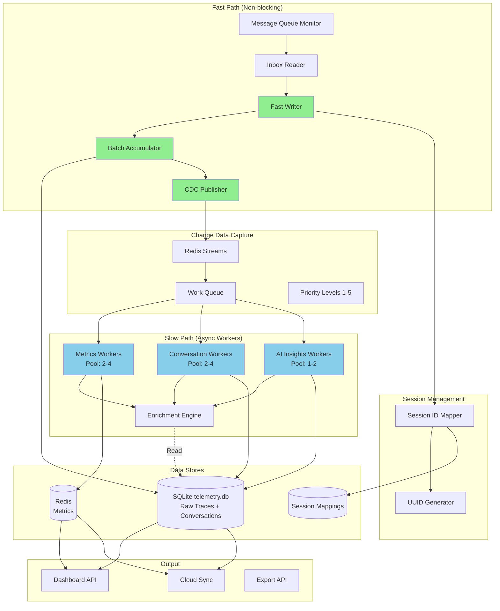

<!--
Copyright © 2025 Sierra Labs LLC
SPDX-License-Identifier: AGPL-3.0-only
License-Filename: LICENSE
-->

# Layer 2: Local Telemetry Server

> Part of the Blueplane MVP Architecture
> [Back to Main Architecture](./BLUEPLANE_MVP_ARCHITECTURE.md)

---

## Overview

The local telemetry server uses a **non-blocking async architecture** with separate fast and slow processing paths. The fast path ensures low-latency raw event capture (<10ms with compression), while async workers handle enrichment, metrics calculation, and AI insights without blocking ingestion. All persistent storage is handled by Layer 2 (Layer 1 only emits events).

## Architecture



## Components

### 2.1 Fast Path Consumer

**Non-blocking Message Consumption with Zero Reads**:

```python
# server/fast_path/consumer.py (pseudocode)

class FastPathConsumer:
    """
    High-throughput consumer that writes raw events with minimal blocking.
    Target: <10ms per batch at P95 (includes zlib compression overhead).
    """

    batch_size = 100
    batch_timeout = 0.1  # 100ms

    async def start():
        """
        Main consumer loop - never blocks on I/O.

        While True:
        - Poll inbox for new messages (limit 1000, non-blocking)
        - For each message:
          - Read and parse JSON
          - Delete message file immediately
          - Add _sequence (atomic increment) and _ingested_at
          - Append to batch
          - Flush if batch_size reached
        - Time-based flush if batch_timeout exceeded
        - Sleep 1ms to prevent CPU spinning
        - Move errors to DLQ (don't block)
        """

    async def _flush():
        """
        Write batch to SQLite (compressed) and publish CDC events.

        - writer.write_batch(batch)  # SQLite insert with zlib compression
        - For each event: cdc.publish(...)  # Fire-and-forget
        - Clear batch
        """
```

### 2.2 Session Management

**Session ID Mapping and Registry**:

```python
# server/session/manager.py (pseudocode)

class SessionManager:
    """
    Maps external platform session IDs to internal UUIDs.
    Provides session registry with project/platform organization.
    """

    async def get_or_create(
        external_id: str,
        platform: str,
        project_hash: str,
        workspace_path: str = None
    ) -> Session:
        """
        Get existing or create new internal session mapping.

        - Check for existing mapping by (external_id, platform, project_hash)
        - If exists: Update last_seen, return existing Session
        - If not: Generate new UUID, insert mapping, return new Session
        - Schema: session_mappings table (see database_architecture_detailed.md)
        """

    def get_by_external(external_id: str, platform: str) -> Optional[Session]:
        """
        Look up internal session by external ID.

        - Query session_mappings WHERE external_id = ? AND platform = ?
        - Return most recent by last_seen
        """
```

### 2.3 Async Worker Pools

**Parallel Processing with Priority Queues**:

```python
# server/slow_path/worker_pools.py (pseudocode)

class WorkerPoolManager:
    """
    Manages async workers for enrichment and metrics calculation.
    Workers read from CDC queue, not from message queue.
    """

    worker_config = {
        'metrics': {'count': 2, 'priority': [1, 2, 3]},
        'conversation': {'count': 2, 'priority': [1, 2]},
        'ai_insights': {'count': 1, 'priority': [4, 5]}
    }

    async def start():
        """
        Start all worker pools.

        - Create MetricsWorker instances (2x)
        - Create ConversationWorker instances (2x)
        - Create AIInsightsWorker instances (1x)
        - Start async task for each worker with _run_worker()
        - Gather all tasks
        """

    async def _run_worker(worker, priorities):
        """
        Run single worker with priority filtering.

        While True:
        - XREADGROUP from 'cdc:events' (block 1000ms)
        - Check event priority matches worker type
        - Call worker.process(event)
        - XACK on success
        - Log errors but continue (don't crash worker)
        """
```

**Metrics Calculation Engine**:

```python
# server/processing/metrics.py (pseudocode)

class MetricsCalculator:
    """
    Calculates derived metrics from raw events.
    See layer2_metrics_derivation.md for detailed formulas.
    """

    def calculate(events: List[Event]) -> Metrics:
        """
        Calculate all metrics from event batch.

        Returns:
        - acceptance_rate: True acceptance considering time-to-rejection
        - latency_p95: 95th percentile latency
        - error_rate: Tool failure rate
        - productivity_score: Composite efficiency metric
        - code_impact: Lines changed, files modified
        """
```

### 2.4 Hierarchical Storage

**Storage Organization**:

```python
# server/storage/hierarchy.py (pseudocode)

class HierarchicalStorage:
    """
    Storage hierarchy: user > project > platform > session

    Directory structure:
    ~/.blueplane/data/{user_hash}/projects/{project_hash}/{platform}/sessions/{session_uuid}/

    Files per session:
    - events.jsonl: Raw event log
    - metrics.json: Aggregated metrics
    - insights.json: AI-generated insights
    """

    def _get_user_hash() -> str:
        """
        Generate deterministic user hash from system info.
        - Hash username + hostname with SHA256
        - Return first 12 characters
        """

    def get_session_path(project_hash: str, platform: str, session_uuid: str) -> Path:
        """
        Get session storage directory path.
        - Returns: ~/.blueplane/data/{user_hash}/projects/{project_hash}/{platform}/sessions/{session_uuid}
        """

    def store_event(event: dict, project_hash: str, platform: str, session_uuid: str):
        """
        Store event in hierarchical structure.
        - Ensure session directory exists
        - Append to events.jsonl
        """

    def get_project_metrics(project_hash: str) -> Dict:
        """
        Aggregate metrics across all platforms/sessions in a project.
        - Iterate through platform directories
        - Aggregate session metrics with weighted averages
        """
```

### 2.5 AI Insights Module

**Local LLM Integration**:

```python
# server/ai/insights.py (pseudocode)

class AIInsightsEngine:
    """
    Generates AI-powered insights from telemetry data.
    Uses local LLM or API (configurable).
    """

    async def analyze_session(session: Session) -> Insights:
        """
        Generate session insights without sending code.

        - Get session metrics and patterns (metadata only)
        - Render prompt template with metrics/patterns
        - Call LLM for analysis
        - Parse and structure insights
        - Never send actual code content (privacy-first)
        """

    async def suggest_improvements(history: List[Session]) -> List[Suggestion]:
        """
        Suggest workflow improvements based on historical patterns.
        - Analyze trends across sessions
        - Identify optimization opportunities
        """
```

### 2.6 Storage Layer

**Integrated Storage Manager**:

```python
# server/storage/manager.py (pseudocode)

class StorageManager:
    """
    Unified storage interface for all Layer 2 data.
    Coordinates SQLite (raw traces + conversations), Redis, and hierarchical file storage.
    """

    async def store_event(event: dict):
        """
        Store event with session mapping.

        - Get or create internal session UUID from external_id/platform/project
        - Store in hierarchical filesystem (events.jsonl)
        - Update real-time metrics cache (Redis)
        - Update session activity timestamp
        """

    async def get_session_history(
        external_id: str = None,
        internal_uuid: str = None,
        platform: str = None
    ) -> List[Event]:
        """
        Retrieve session history by external or internal ID.

        - Map external_id to internal UUID if needed
        - Get project_hash and platform from session_mappings
        - Read events.jsonl from hierarchical storage
        - Return parsed events list
        """

    async def _update_session_activity(session_uuid: str):
        """
        Update last_seen timestamp for session.
        - UPDATE session_mappings SET last_seen = NOW()
        """
```

### 2.7 Configuration

```yaml
# server/config/server.yaml
server:
  host: 127.0.0.1
  port: 7531

message_queue:
  path: ~/.blueplane/mq
  poll_interval: 100  # milliseconds
  max_retries: 3
  dlq_retention_days: 30

session_management:
  mapping_db: ~/.blueplane/sessions.db
  external_id_retention_days: 90
  uuid_format: uuid4

processing:
  workers: 4
  pipeline_timeout: 5000
  batch_size: 100

storage:
  hierarchy_root: ~/.blueplane/data
  user_hash_algorithm: sha256
  event_retention_days: 90
  metrics_retention_days: 365
  cache_ttl: 3600

ai:
  enabled: true
  provider: local  # local | openai | anthropic
  model: llama2-7b
  api_key_env: BLUEPLANE_AI_KEY

sync:
  enabled: false
  cloud_endpoint: https://api.blueplane.io
  sync_interval: 300
  batch_size: 1000
```

## API Specification

### Phase 1: REST + WebSocket API

The Layer 2 server provides a **REST API for queries and operations** plus **WebSocket connections for real-time streaming**. This covers all immediate needs for CLI, Dashboard, and MCP Server integration.

```yaml
# server/api/openapi.yaml
openapi: 3.0.0
info:
  title: Blueplane Local Telemetry API
  version: 2.0.0
  description: REST API for telemetry queries and operations

servers:
  - url: http://localhost:7531/api/v1
    description: Local server

paths:
  # =======================
  # Metrics Endpoints
  # =======================
  /metrics/current:
    get:
      summary: Get current session metrics
      tags: [Metrics]
      responses:
        200:
          description: Current metrics
          content:
            application/json:
              schema:
                $ref: '#/components/schemas/CurrentMetrics'

  /metrics:
    get:
      summary: Get historical metrics
      tags: [Metrics]
      parameters:
        - name: period
          in: query
          schema:
            type: string
            enum: [1h, 24h, 7d, 30d]
        - name: session_id
          in: query
          schema:
            type: string
        - name: platform
          in: query
          schema:
            type: string
        - name: group_by
          in: query
          schema:
            type: string
      responses:
        200:
          content:
            application/json:
              schema:
                $ref: '#/components/schemas/MetricsResponse'

  # =======================
  # Session Endpoints
  # =======================
  /sessions:
    get:
      summary: List sessions with filtering
      tags: [Sessions]
      parameters:
        - name: limit
          in: query
          schema:
            type: integer
            default: 10
        - name: offset
          in: query
          schema:
            type: integer
            default: 0
        - name: platform
          in: query
          schema:
            type: string
        - name: project_hash
          in: query
          schema:
            type: string
        - name: min_acceptance
          in: query
          schema:
            type: number
      responses:
        200:
          content:
            application/json:
              schema:
                $ref: '#/components/schemas/SessionList'

  /sessions/{sessionId}:
    get:
      summary: Get session details
      tags: [Sessions]
      parameters:
        - name: sessionId
          in: path
          required: true
          schema:
            type: string
      responses:
        200:
          content:
            application/json:
              schema:
                $ref: '#/components/schemas/SessionDetail'

  /sessions/{sessionId}/timeline:
    get:
      summary: Get session timeline events
      tags: [Sessions]
      parameters:
        - name: sessionId
          in: path
          required: true
          schema:
            type: string
        - name: limit
          in: query
          schema:
            type: integer
            default: 100
      responses:
        200:
          content:
            application/json:
              schema:
                $ref: '#/components/schemas/Timeline'

  /sessions/{sessionId}/analysis:
    get:
      summary: Get deep session analysis
      tags: [Sessions]
      parameters:
        - name: sessionId
          in: path
          required: true
          schema:
            type: string
      responses:
        200:
          content:
            application/json:
              schema:
                $ref: '#/components/schemas/SessionAnalysis'

  # =======================
  # Analysis Endpoints
  # =======================
  /analysis/acceptance:
    get:
      summary: Analyze acceptance patterns
      tags: [Analysis]
      parameters:
        - name: file_type
          in: query
          schema:
            type: string
        - name: timeframe
          in: query
          schema:
            type: string
      responses:
        200:
          content:
            application/json:
              schema:
                $ref: '#/components/schemas/AcceptanceAnalysis'

  /analysis/errors:
    get:
      summary: Get error patterns
      tags: [Analysis]
      parameters:
        - name: period
          in: query
          schema:
            type: string
        - name: min_frequency
          in: query
          schema:
            type: integer
      responses:
        200:
          content:
            application/json:
              schema:
                $ref: '#/components/schemas/ErrorPatterns'

  # =======================
  # Export Endpoints
  # =======================
  /export:
    get:
      summary: Export data
      tags: [Export]
      parameters:
        - name: format
          in: query
          required: true
          schema:
            type: string
            enum: [csv, json, parquet]
        - name: start_date
          in: query
          schema:
            type: string
            format: date
        - name: end_date
          in: query
          schema:
            type: string
            format: date
      responses:
        200:
          content:
            application/octet-stream:
              schema:
                type: string
                format: binary

  # =======================
  # Insights Endpoints
  # =======================
  /insights:
    get:
      summary: Get AI-powered insights
      tags: [Insights]
      parameters:
        - name: type
          in: query
          schema:
            type: string
            enum: [productivity, errors, patterns]
        - name: session_id
          in: query
          schema:
            type: string
      responses:
        200:
          content:
            application/json:
              schema:
                $ref: '#/components/schemas/InsightsResponse'

  # =======================
  # Configuration Endpoints
  # =======================
  /config:
    get:
      summary: Get configuration
      tags: [Config]
      responses:
        200:
          content:
            application/json:
              schema:
                type: object

    post:
      summary: Update configuration
      tags: [Config]
      requestBody:
        content:
          application/json:
            schema:
              type: object
      responses:
        200:
          content:
            application/json:
              schema:
                type: object

# WebSocket endpoints (documented separately)
# ws://localhost:7531/ws/metrics - Real-time metrics stream
# ws://localhost:7531/ws/events - Event stream
# ws://localhost:7531/ws/sessions/{sessionId} - Session-specific stream
```

### WebSocket Endpoints

```python
# server/websocket/endpoints.py (pseudocode)

class WebSocketManager:
    """WebSocket connection manager for real-time data streaming"""

    async def metrics_stream(websocket: WebSocket):
        """
        WebSocket: ws://localhost:7531/ws/metrics
        Streams real-time metrics updates every second.

        - Accept connection
        - Loop: Get current metrics, send JSON, sleep 1s
        - Handle disconnect gracefully
        """

    async def event_stream(websocket: WebSocket, session_id: Optional[str] = None):
        """
        WebSocket: ws://localhost:7531/ws/events
        Streams telemetry events in real-time.

        - Accept connection
        - Watch events (optionally filtered by session_id)
        - Send each event as JSON message
        """

    async def session_stream(websocket: WebSocket, session_id: str):
        """
        WebSocket: ws://localhost:7531/ws/sessions/{sessionId}
        Streams session-specific updates.

        - Accept connection
        - Loop: Get session update, send if available, sleep 0.5s
        """
```

### Future Enhancement: GraphQL API

**Planned for Phase 2** - GraphQL will be added for complex, nested queries that benefit from field selection and single-request aggregation. This is particularly useful for dashboard initialization and complex analytics queries.

```graphql
# Future: server/graphql/schema.graphql
# This will be implemented in Phase 2 for complex dashboard queries

type Query {
  # Complex dashboard initialization query
  dashboardData(timeRange: String!): DashboardData!

  # Nested session data with selective field loading
  sessionWithRelations(id: ID!): SessionComplete!

  # Multi-dimensional metrics aggregation
  complexMetrics(filters: MetricsFilter!): AggregatedMetrics!
}

type DashboardData {
  metrics: MetricsSummary!
  recentSessions: [Session!]!
  insights: [Insight!]!
  trends: TrendAnalysis!
  activeAlerts: [Alert!]!
}

# Benefits of GraphQL (when added):
# 1. Single request for complex dashboard initialization
# 2. Field selection reduces payload size
# 3. Strong typing for complex nested queries
# 4. Better handling of relationships (sessions -> conversations -> metrics)
```

---

[Back to Main Architecture](./BLUEPLANE_MVP_ARCHITECTURE.md)
