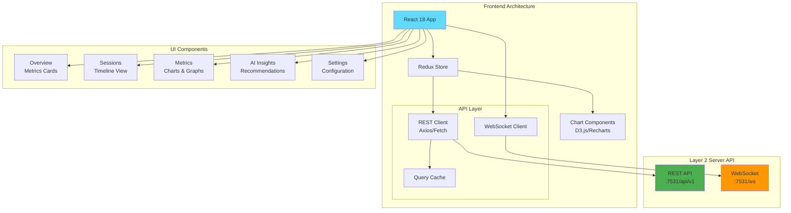

<!--
Copyright © 2025 Sierra Labs LLC
SPDX-License-Identifier: AGPL-3.0-only
License-Filename: LICENSE
-->

# Layer 3: Local Dashboard

> React-based Web Dashboard for Personal Telemetry Visualization
> Part of the Blueplane MVP Architecture
> [Back to Main Architecture](./BLUEPLANE_MVP_ARCHITECTURE.md)

---

## Overview

A web-based dashboard for individual developers to visualize their personal metrics, track productivity, and gain insights from their AI-assisted coding sessions. The dashboard uses **REST API for data queries** and **WebSocket for real-time updates**.

## Architecture

### Phase 1: REST + WebSocket Implementation



### API Communication Pattern

```typescript
// dashboard/src/api/client.ts (pseudocode)

class DashboardAPIClient {
    /**
     * REST + WebSocket client for Layer 2 communication.
     *
     * - REST client: GET/POST to http://localhost:7531/api/v1/*
     * - WebSocket: ws://localhost:7531/ws/metrics for real-time
     *
     * Methods:
     * - getMetrics(period): Fetch metrics by time period
     * - getSessions(filters): Query sessions with filters
     * - getSessionAnalysis(id): Get detailed session analysis
     * - connectRealtime(): Establish WebSocket, dispatch updates to Redux store
     */
}
```

### Data Flow

| Data Type | API Method | Update Pattern | Use Case |
|-----------|------------|----------------|----------|
| **Initial Load** | REST GET | Once on mount | Dashboard initialization |
| **Historical Data** | REST GET | On demand | Session analysis, date ranges |
| **Real-time Metrics** | WebSocket | Continuous stream | Live metrics cards |
| **User Actions** | REST POST | On interaction | Settings, exports |
| **Event Stream** | WebSocket | Continuous | Activity timeline |

### WebSocket Real-Time Implementation

The dashboard uses WebSocket for real-time updates from Redis TimeSeries metrics and conversation events.

#### Server-Side WebSocket Handler

```python
# server/api/websocket.py (pseudocode)

class MetricsWebSocketHandler:
    """
    WebSocket handler for real-time metrics streaming.
    Connects to Redis pub/sub for metric updates.
    """

    def __init__():
        """
        Initialize WebSocket handler.

        - Create Redis connection for pub/sub
        - Subscribe to metric update channels
        - Initialize connection pool
        """

    async def handle_connection(websocket):
        """
        Handle WebSocket connection from dashboard.

        Flow:
        1. Accept WebSocket connection
        2. Send initial metrics snapshot from Redis (TS.GET all metrics)
        3. Subscribe to Redis pub/sub channels:
           - metrics:updates (real-time metric changes)
           - sessions:active (active session count)
           - events:stream (recent events for activity timeline)
        4. Stream updates to client as JSON messages
        5. Handle disconnection and cleanup

        Message Format:
        {
            "type": "metric_update" | "session_update" | "event",
            "timestamp": "2025-11-09T...",
            "data": {
                "metric_name": "acceptance_rate",
                "value": 0.85,
                "trend": "+5%"
            }
        }
        """

    async def publish_metrics():
        """
        Periodic task to push latest metrics to connected clients.

        - Every 1 second: Query Redis TimeSeries for latest values
        - For each connected WebSocket: Send metric_update message
        - Debounce: Only send if value changed since last push
        """

    async def stream_events():
        """
        Stream recent events from Redis Streams to dashboard.

        - Use XREAD on cdc:events stream
        - Filter for user-visible events (tool_use, code_change)
        - Push as event messages to dashboard activity timeline
        """
```

#### Client-Side WebSocket Integration

```typescript
// dashboard/src/hooks/useWebSocket.ts (pseudocode)

export const useWebSocket = () => {
  /**
   * React hook for WebSocket connection management.
   *
   * Features:
   * - Auto-connect on mount
   * - Auto-reconnect on disconnect (exponential backoff)
   * - Dispatch updates to Redux store
   * - Parse incoming messages by type
   *
   * Message handlers:
   * - metric_update: Update metrics slice in Redux
   * - session_update: Update active sessions count
   * - event: Append to activity timeline
   *
   * Usage:
   * const { connected, lastMessage } = useWebSocket();
   */
};
```

#### Redis Integration for Real-Time Updates

The WebSocket server reads from multiple Redis data sources:

```python
# server/api/realtime_metrics.py (pseudocode)

class RealtimeMetricsProvider:
    """
    Provides real-time metrics data from Redis to WebSocket handler.
    """

    async def get_latest_metrics() -> Dict:
        """
        Get latest metric values from Redis TimeSeries.

        - Execute TS.GET for each metric key
        - Return dict of metric_name -> {value, timestamp}

        Metrics:
        - metric:realtime:active_sessions
        - metric:realtime:events_per_second
        - metric:session:acceptance_rate
        - metric:session:productivity_score
        - metric:tools:tool_latency_p95
        """

    async def subscribe_to_updates(callback):
        """
        Subscribe to Redis pub/sub for metric updates.

        - SUBSCRIBE to metrics:updates channel
        - When message received: Parse and call callback(metric_update)
        - Callback sends WebSocket message to connected clients
        """

    async def get_recent_events(limit: int = 50) -> List[Dict]:
        """
        Get recent events from SQLite for activity timeline.

        - Query SQLite conversations table for recent turns
        - Join with code_changes for file modifications
        - Return list of events with timestamps
        - ORDER BY timestamp DESC LIMIT limit
        """
```

#### Update Frequency and Performance

| Metric Type | Update Frequency | Redis Source | Latency |
|-------------|------------------|--------------|---------|
| **Active Sessions** | 1 second | Redis TS.GET | <5ms |
| **Acceptance Rate** | On event | Redis pub/sub | <10ms |
| **Events Per Second** | 1 second | Redis TS.GET | <5ms |
| **Activity Timeline** | On new event | SQLite query | <20ms |
| **Tool Latency** | 5 seconds | Redis TS.RANGE | <10ms |

**Performance Optimization**:
- **Debouncing**: WebSocket messages throttled to max 10/second per client
- **Batching**: Multiple metric updates batched into single WebSocket message
- **Caching**: Redis values cached for 1 second to reduce TS.GET calls
- **Selective Updates**: Only send changed metrics to reduce bandwidth

## UI Components

### 3.1 Dashboard Layout

```typescript
// dashboard/src/layouts/MainLayout.tsx (pseudocode)

export const MainLayout: React.FC = () => {
  /**
   * Main dashboard layout with sidebar navigation.
   *
   * Structure:
   * - Sidebar: Navigation items (Overview, Sessions, Metrics, Insights, Settings)
   * - Header: SessionSelector, DateRangePicker, RefreshButton
   * - Routes: React Router routes for each page
   */
};
```

### 3.2 Overview Dashboard

```typescript
// dashboard/src/pages/Overview.tsx (pseudocode)

export const Overview: React.FC = () => {
  /**
   * Main overview dashboard with real-time metrics.
   *
   * Components:
   * - MetricCard: Acceptance Rate, Productivity Score (with trends)
   * - LineChart: Session Activity over time (real-time WebSocket data)
   * - HeatMap: Productivity by hour
   *
   * Data sources: useMetrics() hook, useWebSocket() for real-time
   */
};
```

### 3.3 Metrics Visualization

```typescript
// dashboard/src/components/charts/AcceptanceChart.tsx (pseudocode)

export const AcceptanceChart: React.FC = () => {
  /**
   * Line chart showing acceptance patterns over time.
   *
   * Lines:
   * - Direct Accept (green, #4caf50)
   * - Partial Accept (orange, #ff9800)
   * - Rejected (red, #f44336)
   *
   * Uses: Recharts library, useAcceptanceData() hook
   * Size: Responsive, 400px height
   */
};
```

### 3.4 Session Explorer

```typescript
// dashboard/src/pages/Sessions.tsx (pseudocode)

export const SessionExplorer: React.FC = () => {
  /**
   * Split-pane session explorer (30% list, 70% detail).
   *
   * Left pane: SessionList with session selection
   * Right pane: SessionDetail showing:
   * - Timeline: Event sequence visualization
   * - MetricsSummary: Key session metrics
   * - ToolUsage: Tool frequency breakdown
   * - CodeImpact: Lines changed, files modified
   *
   * State: selectedSession via useState hook
   */
};
```

### 3.5 AI Insights Panel

```typescript
// dashboard/src/components/Insights.tsx (pseudocode)

export const InsightsPanel: React.FC = () => {
  /**
   * AI-powered insights panel with actionable suggestions.
   *
   * - Header: Title and RefreshButton
   * - Content: Map of InsightCard components
   *
   * Each InsightCard shows:
   * - type, priority, title, description, actions
   *
   * Data: useInsights() hook from Layer 2 API
   */
};
```

## Features

### Current Features (Phase 1)

1. **Real-Time Monitoring**
   - Live session tracking via WebSocket
   - Event stream visualization
   - Active tool monitoring
   - Metrics updates every second

2. **Historical Analysis**
   - REST API queries for date ranges
   - Trend analysis and comparisons
   - Comparative metrics
   - Pattern detection

3. **Productivity Insights**
   - Personal productivity score
   - Peak productivity hours
   - Tool efficiency analysis
   - AI-powered recommendations

4. **Export Capabilities**
   - CSV/JSON export via REST
   - Report generation
   - Chart downloads
   - Data anonymization options

## Implementation Phases

### Phase 1: REST + WebSocket (Current)
✅ **Implemented**: Simple, efficient API pattern
- REST endpoints for all CRUD operations
- WebSocket for real-time updates only
- Straightforward caching strategy
- Easy to debug and test

### Phase 2: GraphQL Enhancement (Future)
🔄 **Planned**: For complex dashboard queries
```graphql
# Future: Complex dashboard initialization in one request
query DashboardInit($timeRange: String!) {
  dashboardData(timeRange: $timeRange) {
    metrics {
      current
      trends
      comparisons
    }
    sessions(limit: 10) {
      id
      conversations {
        timeline {
          events
        }
      }
    }
    insights {
      productivity
      patterns
      recommendations
    }
  }
}
```

**Benefits of future GraphQL addition:**
- Single request for complex dashboard initialization
- Reduced payload with field selection
- Better handling of nested relationships
- Optimized mobile dashboard support

**GraphQL will be added when:**
- Dashboard queries become too complex for REST
- Multiple round-trips impact performance
- Mobile app requires selective field loading
- Team dashboards need aggregated data

## Performance Optimization

### Current Optimizations (REST + WebSocket)

1. **Request Batching**: Group multiple REST calls
2. **Response Caching**: 60-second TTL for repeated queries
3. **WebSocket Debouncing**: Throttle updates to prevent UI overload
4. **Lazy Loading**: Load data as user navigates
5. **Virtual Scrolling**: For large session lists

### API Usage Examples

```typescript
// dashboard/src/controllers/DashboardController.ts (pseudocode)

class DashboardController {
    /**
     * Phase 1: REST + WebSocket implementation.
     *
     * initializeDashboard():
     * - Parallel REST calls: Promise.all([metrics, sessions, insights])
     * - Connect WebSocket for real-time updates
     * - Return initial data
     *
     * connectWebSocket():
     * - Create WebSocket to ws://localhost:7531/ws/metrics
     * - onmessage: parse JSON and updateRealtimeMetrics()
     */
}

class DashboardControllerV2 {
    /**
     * Future Phase 2: GraphQL for complex queries.
     *
     * - Single GraphQL query for dashboardData(timeRange)
     * - Still use WebSocket for real-time updates
     * - Simplifies initialization with nested data fetching
     */
}
```

---

[Back to Main Architecture](./BLUEPLANE_MVP_ARCHITECTURE.md) | [CLI Interface](./layer3_cli_interface.md) | [MCP Server](./layer3_mcp_server.md)
