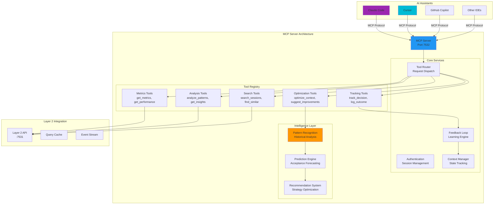

<!--
Copyright © 2025 Sierra Labs LLC
SPDX-License-Identifier: AGPL-3.0-only
License-Filename: LICENSE
-->

# Layer 3: MCP Server

> Model Context Protocol Server for AI-Assisted Coding Integration
> Part of the Blueplane MVP Architecture
> [Back to Main Architecture](./BLUEPLANE_MVP_ARCHITECTURE.md)

---

## Overview

The Blueplane MCP Server enables **AI assistants to become telemetry-aware**, providing real-time access to metrics, patterns, and insights during active coding sessions. This creates a feedback loop where AI tools can learn from their own performance and adapt their behavior based on historical data.

## Architecture



## MCP Tools

### Tool Categories

The MCP server provides five categories of tools for AI assistants:

| Category | Purpose | Example Tools |
|----------|---------|---------------|
| **Metrics** | Query performance data | `get_current_metrics`, `get_session_metrics` |
| **Analysis** | Pattern recognition | `analyze_acceptance_patterns`, `get_error_patterns` |
| **Search** | Find relevant sessions | `search_similar_tasks`, `find_successful_patterns` |
| **Optimization** | Improve generation | `optimize_context`, `suggest_strategy` |
| **Tracking** | Feedback loop | `track_decision`, `log_outcome` |
| **Traces (Claude Code)** | Deep trace introspection | `trace_get_timeline`, `trace_compare_generation` |

### Tool Definitions

#### Metrics Tools

```typescript
interface MetricsTools {
  /**
   * Get current session metrics
   */
  get_current_metrics(): {
    acceptance_rate: number;
    productivity_score: number;
    error_rate: number;
    tools_used: number;
    lines_changed: number;
    session_duration: number;
  };

  /**
   * Get historical metrics for analysis
   */
  get_session_metrics(params: {
    session_id?: string;
    period?: string;  // "1h", "24h", "7d"
    platform?: string;
  }): MetricsResponse;

  /**
   * Get tool-specific performance data
   */
  get_tool_performance(params: {
    tool_name?: string;
    period?: string;
    include_latency?: boolean;
  }): ToolPerformanceResponse;

  /**
   * Get real-time metrics stream
   */
  subscribe_metrics(params: {
    metrics: string[];
    interval: number;  // milliseconds
  }): AsyncIterator<MetricsUpdate>;
}
```

#### Analysis Tools

```typescript
interface AnalysisTools {
  /**
   * Analyze code acceptance patterns
   */
  analyze_acceptance_patterns(params: {
    file_type?: string;
    operation?: string;  // "create", "edit", "refactor"
    timeframe?: string;
  }): {
    patterns: AcceptancePattern[];
    insights: string[];
    recommendations: string[];
  };

  /**
   * Identify error patterns and anti-patterns
   */
  get_error_patterns(params: {
    period?: string;
    min_frequency?: number;
    tool?: string;
  }): {
    patterns: ErrorPattern[];
    common_causes: string[];
    prevention_tips: string[];
  };

  /**
   * Analyze productivity patterns
   */
  analyze_productivity(params: {
    context?: string;
    compare_to?: string;  // "personal_best", "team_average"
  }): ProductivityAnalysis;

  /**
   * Get insights for current context
   */
  get_contextual_insights(params: {
    current_file?: string;
    recent_operations?: string[];
    metrics?: object;
  }): InsightResponse;
}
```

#### Search Tools

```typescript
interface SearchTools {
  /**
   * Find similar coding tasks from history
   */
  search_similar_tasks(params: {
    task_description: string;
    limit?: number;
    min_similarity?: number;  // 0-1
  }): {
    sessions: SimilarSession[];
    common_patterns: string[];
    success_strategies: string[];
  };

  /**
   * Find successful implementation patterns
   */
  find_successful_patterns(params: {
    file_type: string;
    operation_type: string;
    min_acceptance?: number;
  }): PatternMatch[];

  /**
   * Search sessions by criteria
   */
  search_sessions(params: {
    query?: string;
    filters?: SessionFilters;
    sort_by?: string;
    limit?: number;
  }): SessionSearchResults;

  /**
   * Find related conversations
   */
  find_related_conversations(params: {
    current_context: string;
    platform?: string;
    limit?: number;
  }): ConversationMatch[];
}
```

#### Optimization Tools

```typescript
interface OptimizationTools {
  /**
   * Optimize AI context for better performance
   */
  optimize_context(params: {
    current_context: ContextState;
    target_metric?: string;  // "acceptance", "speed", "quality"
  }): {
    optimized_context: ContextState;
    expected_improvement: number;
    changes_made: string[];
  };

  /**
   * Suggest generation strategy
   */
  suggest_strategy(params: {
    task_type: string;
    file_context: FileContext;
    historical_performance?: object;
  }): {
    strategy: GenerationStrategy;
    reasoning: string;
    confidence: number;
  };

  /**
   * Predict acceptance probability
   */
  predict_acceptance(params: {
    code: string;
    file_type: string;
    operation: string;
    context?: object;
  }): {
    probability: number;
    factors: AcceptanceFactor[];
    suggestions: string[];
  };

  /**
   * Recommend tool selection
   */
  recommend_tools(params: {
    task_description: string;
    available_tools: string[];
    performance_history?: object;
  }): ToolRecommendation[];
}
```

#### Tracking Tools

```typescript
interface TrackingTools {
  /**
   * Track AI decision for learning
   */
  track_decision(params: {
    decision_type: string;
    decision_data: object;
    context: object;
    timestamp?: string;
  }): {
    decision_id: string;
    tracked: boolean;
  };

  /**
   * Log outcome of tracked decision
   */
  log_outcome(params: {
    decision_id: string;
    outcome: "accepted" | "rejected" | "modified";
    feedback?: string;
    metrics?: object;
  }): {
    logged: boolean;
    learning_applied: boolean;
  };

  /**
   * Record conversation turn
   */
  record_turn(params: {
    turn_type: string;
    content_hash: string;
    metadata: object;
  }): {
    turn_id: string;
    sequence_number: number;
  };

  /**
   * Submit feedback batch
   */
  submit_feedback(params: {
    feedback_items: FeedbackItem[];
    session_context?: object;
  }): FeedbackResponse;
}
```

#### Trace Tools (Claude Code)

```typescript
interface TraceTools {
  /**
   * Phase 1: Paginated timeline for a Claude session.
   */
  trace_get_timeline(params: {
    session_id: string;
    project_name?: string;
    start?: string;
    end?: string;
    cursor?: number;
    limit?: number;
    event_types?: string[];
  }): {
    items: TraceTimelineItem[];
    has_more: boolean;
    next_cursor?: number;
  };

  /**
   * Phase 1: Compare a generation UUID against surrounding events.
   */
  trace_compare_generation(params: {
    generation_id: string;
    tolerance_seconds?: number;
  }): TraceComparison;

  /**
   * Phase 2: Detect gaps where traces stop arriving.
   */
  trace_find_gaps(params: {
    session_id?: string;
    project_name?: string;
    minimum_gap_seconds?: number;
    since?: string;
  }): TraceGap[];

  /**
   * Phase 2: Targeted payload inspection with selector syntax.
   */
  trace_inspect_payload(params: {
    sequence?: number;
    uuid?: string;
    selectors?: string[];
  }): TraceInspectionResult;
}
```

> **Scope:** Trace tools are explicitly scoped to Claude Code telemetry and are only exposed on localhost transports to protect sensitive session data.

## Implementation

### MCP Server Core

```python
# mcp/server.py (pseudocode)
# Dependencies: mcp>=0.1.0, fastapi, httpx, pydantic, numpy, scikit-learn

class BlueplanceMCPServer:
    """
    MCP server providing telemetry-aware tools for AI coding assistants.
    Exposes 5 tool categories: Metrics, Analysis, Search, Optimization, Tracking
    """

    def __init__(layer2_url: str, port: int = 7532):
        """
        Initialize MCP server with intelligence components.
        - Set up Server("blueplane-telemetry")
        - Initialize ContextManager, PatternEngine, PredictionEngine, FeedbackLoop
        - Register all tool categories via _setup_*_tools() methods
        """

    def _setup_metrics_tools():
        """
        Register metrics tools: get_current_metrics, get_session_metrics
        - Tools make HTTP GET requests to Layer 2 API (/api/v1/metrics/*)
        - Add context-aware insights from pattern_engine
        - Return JSON with success/error and data/insights
        """

    def _setup_analysis_tools():
        """
        Register analysis tools: analyze_acceptance_patterns, get_error_patterns
        - Query Layer 2 analysis endpoints with filters
        - Use pattern_engine to analyze results
        - Generate recommendations based on analysis
        - Return patterns, insights, recommendations with confidence scores
        """

    def _setup_search_tools():
        """
        Register search tools: search_similar_tasks, find_successful_patterns
        - Vectorize search queries with pattern_engine
        - POST to Layer 2 search endpoints
        - Filter results by similarity threshold
        - Extract strategies and common patterns
        - Return similar sessions with best strategies
        """

    def _setup_optimization_tools():
        """
        Register optimization tools: optimize_context, predict_acceptance
        - analyze context with context_manager
        - Get optimization suggestions from prediction_engine
        - Predict acceptance probability using ML features
        - Calculate expected improvement
        - Return optimized context and suggestions
        """

    def _setup_tracking_tools():
        """
        Register tracking tools: track_decision, log_outcome
        - Generate decision IDs for tracking
        - Store decisions in feedback_loop
        - POST to Layer 2 tracking endpoints
        - Trigger batch learning when threshold reached
        - Update models with new patterns/weights
        - Return tracking status and learning applied
        """

    async def run():
        """
        Start MCP server.
        - Initialize server
        - Start background tasks: feedback_loop.process_loop(), pattern_engine.update_loop()
        - Run server forever on configured port
        """
```

### Intelligence Components

```python
# mcp/intelligence.py (pseudocode)

class PatternEngine:
    """
    Pattern recognition and analysis engine.
    Caches patterns, vectorizes text, analyzes acceptance patterns.
    """

    def analyze_acceptance(patterns: Dict) -> Dict:
        """
        Analyze acceptance patterns from historical data.
        - Find significant patterns by type
        - Calculate impact and frequency
        - Generate insights from patterns
        - Calculate confidence score
        - Returns: {"patterns": [], "insights": [], "confidence": float}
        """

    def extract_strategies(session_data: Dict) -> List[str]:
        """
        Extract successful strategies from session.
        - Analyze tool usage sequences
        - Analyze edit patterns
        - Analyze context management
        - Returns list of strategy descriptions
        """

    async def update_loop():
        """
        Periodic pattern update (every 5 minutes).
        - Fetch latest patterns from Layer 2 API
        - Update internal models
        - Update last_update timestamp
        """

class PredictionEngine:
    """
    ML-based prediction engine for acceptance forecasting.
    Uses AcceptancePredictor model, ContextOptimizer, FeatureExtractor.
    """

    def predict_acceptance(features: Dict) -> Dict:
        """
        Predict code acceptance probability.
        - Convert features to vector
        - Run through acceptance_model.predict_proba()
        - Calculate confidence from feature completeness
        - Returns: {"probability": float, "confidence": float}
        """

    def optimize_for_metric(context_analysis: Dict, target_metric: str) -> Dict:
        """
        Optimize context for target metric (acceptance/speed/quality).
        - Route to appropriate optimizer based on target_metric
        - Get suggestions from context_optimizer
        - Generate reasoning for optimizations
        - Returns: {"suggestions": [], "changes": [], "reasoning": str}
        """

class FeedbackLoop:
    """
    Continuous learning feedback loop with batch processing.
    Batch size: 10 decisions before triggering model update.
    """

    def track_decision(decision_id, decision_type, data, context, timestamp):
        """
        Track AI decision for later feedback.
        - Store in decisions dict with metadata
        - Set outcome to None (pending)
        """

    def record_outcome(decision_id, outcome, feedback, metrics) -> Dict:
        """
        Record outcome and potentially trigger learning.
        - Update decision with outcome/feedback/metrics
        - Add to learning_queue
        - If queue size >= batch_size: trigger _process_batch_learning()
        - Returns: {"update_triggered": bool, ...}
        """

    async def process_loop():
        """
        Continuous feedback processing.
        - Collect batches of outcomes from learning_queue
        - Apply learning when batch complete
        - Update pattern/prediction models
        """
```

## Configuration

### Claude Code Configuration

Add to `.claude/mcp_servers.json`:

```json
{
  "blueplane": {
    "command": "uv",
    "args": ["run", "--script", "~/.blueplane/mcp/server.py"],
    "env": {
      "BLUEPLANE_LAYER2_URL": "http://localhost:7531",
      "BLUEPLANE_MCP_PORT": "7532"
    },
    "schema": {
      "tools": true,
      "resources": true,
      "prompts": false
    }
  }
}
```

### Cursor Configuration

Add to `~/.cursor/mcp/config.json`:

```json
{
  "servers": [
    {
      "name": "blueplane-telemetry",
      "command": "python3",
      "args": ["~/.cursor/mcp/blueplane_server.py"],
      "enabled": true,
      "autoStart": true,
      "capabilities": {
        "tools": true,
        "contextAware": true
      }
    }
  ]
}
```

### GitHub Copilot Configuration

For Copilot integration (when available):

```json
{
  "github.copilot.advanced": {
    "mcp_servers": {
      "blueplane": {
        "endpoint": "http://localhost:7532",
        "token": "${BLUEPLANE_MCP_TOKEN}",
        "tools": ["metrics", "analysis", "optimization"]
      }
    }
  }
}
```

## Usage Patterns

### Pattern 1: Context-Aware Code Generation

Typical flow for AI assistant code generation with telemetry:

```python
# Example flow (pseudocode)

async def generate_code_with_telemetry(prompt, file_type):
    """
    Context-aware code generation with feedback loop.

    1. Get current metrics and acceptance patterns
    2. Generate code with initial context
    3. Predict acceptance probability
    4. If low (<0.6): optimize context and regenerate
    5. Track decision with decision_id
    6. Return code and decision_id (outcome logged later)
    """
```

### Pattern 2: Learning from Similar Tasks

Search and apply historical learnings:

```python
# Example (pseudocode)

async def learn_from_history(task_description):
    """
    Learn from similar historical tasks.

    1. Search similar tasks (min_similarity=0.7, limit=5)
    2. Extract best_strategies from results
    3. Apply strategies to current task
    4. Return strategies for tracking
    """
```

### Pattern 3: Real-time Performance Optimization

Monitor and adapt during active session:

```python
# Example (pseudocode)

async def monitor_and_adapt():
    """
    Real-time monitoring and adaptation loop.

    While session active (check every 60s):
    1. Get current metrics
    2. If error_rate > 0.1: get error patterns, avoid them
    3. If acceptance_rate < 0.5: get insights, apply recommendations
    4. Dynamically adjust behavior based on metrics
    """
```

## Security & Privacy

### Authentication

- **Local Mode**: No authentication for localhost connections
- **Remote Mode**: Token-based authentication required
- **Session Isolation**: Each AI session has isolated context

### Data Privacy

- **No Code Storage**: MCP server never stores actual code
- **Hashed Content**: All content hashed before transmission
- **Local Processing**: All ML models run locally
- **Opt-out Controls**: Granular control over tracking

### Rate Limiting

```python
# Rate limiting configuration (pseudocode)
RATE_LIMITS = {
    "get_metrics": 100,        # requests per minute
    "analyze_patterns": 20,    # requests per minute
    "predict_acceptance": 50,  # requests per minute
    "track_decision": 200,     # requests per minute
}
```

## Performance

### Optimization Strategies

1. **Caching**: Intelligent caching of frequent queries
2. **Batching**: Batch multiple tool calls when possible
3. **Async Operations**: All I/O operations are async
4. **Connection Pooling**: Reuse HTTP connections to Layer 2
5. **Model Optimization**: Quantized models for fast inference

### Benchmarks

| Operation | Latency (P50) | Latency (P95) | Throughput |
|-----------|---------------|---------------|------------|
| `get_current_metrics` | 5ms | 15ms | 200/s |
| `analyze_patterns` | 50ms | 150ms | 20/s |
| `predict_acceptance` | 20ms | 60ms | 50/s |
| `search_similar` | 100ms | 300ms | 10/s |
| `optimize_context` | 30ms | 90ms | 30/s |

## Monitoring

### Health Checks

```bash
# Check MCP server health
curl http://localhost:7532/health

# Response
{
  "status": "healthy",
  "version": "1.0.0",
  "uptime": 3600,
  "connections": 3,
  "tools_registered": 15,
  "cache_hit_rate": 0.85,
  "layer2_connected": true
}
```

### Metrics Endpoint

```bash
# Get MCP server metrics
curl http://localhost:7532/metrics

# Prometheus-compatible metrics
mcp_requests_total{tool="get_metrics"} 1234
mcp_request_duration_seconds{tool="get_metrics",quantile="0.95"} 0.015
mcp_cache_hits_total 567
mcp_cache_misses_total 89
mcp_active_connections 3
```

## Troubleshooting

### Common Issues

1. **Connection Failed**
   ```
   Error: Cannot connect to MCP server
   Solution: Check server is running: ps aux | grep mcp_server
   ```

2. **Tool Not Found**
   ```
   Error: Tool 'get_metrics' not found
   Solution: Restart MCP server to re-register tools
   ```

3. **Slow Response**
   ```
   Error: Tool call timeout
   Solution: Check Layer 2 server health and network connectivity
   ```

4. **Learning Not Applied**
   ```
   Error: Feedback not improving performance
   Solution: Check minimum batch size and learning threshold settings
   ```

## Future Enhancements

1. **Advanced ML Models**:
   - Transformer-based code understanding
   - Multi-modal pattern recognition
   - Reinforcement learning for strategy optimization

2. **Extended Tool Set**:
   - Code review assistance
   - Automated refactoring suggestions
   - Team collaboration insights

3. **Integration Expansion**:
   - WebSocket streaming for real-time updates
   - GraphQL API for complex queries
   - Plugin system for custom tools

4. **Intelligence Features**:
   - Proactive suggestions before errors occur
   - Personalized learning per developer
   - Cross-IDE knowledge transfer

---

[Back to Main Architecture](./BLUEPLANE_MVP_ARCHITECTURE.md) | [CLI Interface Specification](./layer3_cli_interface.md)